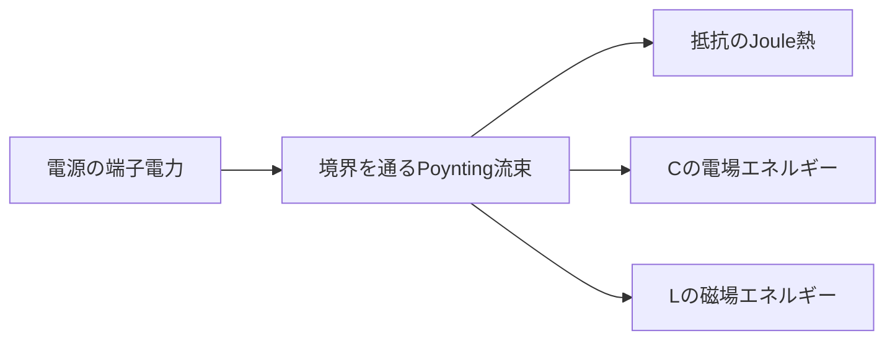

# Poyntingベクトルと回路電力――エネルギーはどこを通るか

## このページで答える問い

端子電力と、空間を通る電磁エネルギー流束はどのように同じ保存則を表すか。

## 前提知識と到達目標

Poynting定理と受動符号規約を前提とし、抵抗・コンデンサ・コイルへのエネルギー流を閉曲面で説明できることを目標とする。

## 現象から見る

電子のドリフトだけを追うと、電池から負荷へエネルギーが速く伝わる理由を説明できない。回路周囲の電場と磁場が作る流束を含め、閉曲面を横切る収支で考える。

この図は、端子電力が場の流束・蓄積・散逸へ分かれることを示す。

## モデル・定義・導出

Poyntingベクトルを

$$
\mathbf{S}=\mathbf{E}\times\mathbf{H}
$$
とする。線形・非分散・損失なしの単純な媒質ではPoynting定理は

$$
\frac{\partial u_{\mathrm{em}}}{\partial t}+\nabla\cdot\mathbf{S}=-\mathbf{J}_{\mathrm{free}}\cdot\mathbf{E}
$$
である。体積積分すると

$$
-\oint_{\partial V}\mathbf{S}\cdot d\mathbf{A}=\frac{dU_{\mathrm{em}}}{dt}+\int_V\mathbf{J}\cdot\mathbf{E}\,dV
$$
を得る。抵抗を囲む境界から内向きに入る流束は、定常時に

$$
P=VI=I^2R=\frac{V^2}{R}
$$
というJoule熱へ移る。コンデンサ充電時は極板間へ流入して電場エネルギーを増やし、コイルでは磁場エネルギーを増やす。電池から抵抗へ至る流束の詳細な流線は幾何と境界条件に依存するが、閉曲面を通る総流束と保存則は一意に検査できる。

## 固有の例

抵抗

$$
R=10\,\Omega
$$
へ

$$
V=5.0\,\mathrm{V}
$$
を加えると

$$
P=V^2/R=2.5\,\mathrm{W}
$$
である。抵抗を囲む閉曲面では、定常時に毎秒2.5 Jの電磁エネルギーが正味で流入する。

## 適用範囲と検算

準定常回路でもPoynting定理自体は有効だが、単純なエネルギー密度式は媒質の分散・損失条件に注意する。端子電力との対応には境界を端子面まで含め、場の蓄積項を評価する。

## 回路図が省略したもの

理想回路図は導線周囲の電場・磁場、表面電荷、空間的な流束、過渡放射を隠す。

## 典型的な誤解

Poynting流線を粒子の軌跡のような唯一の実体と断定しない。重要なのはエネルギー保存と、指定境界を通る総流束である。

## 演習

1. Poyntingベクトルと回路電力の定義を、局所的な場または保存量との関係で説明せよ。
2. 中心式を導け。
3. 本文の数値例を、値を2倍にした場合に再計算せよ。
4. このページの集中定数近似が妥当になる条件を一つ、破綻する条件を一つ挙げよ。
5. 次の説明を修正せよ。「Poynting流線を粒子の軌跡のような唯一の実体と断定しない重要なのはエネルギー保存と、指定境界を通る総流束である」
6. エネルギーまたは電力の収支を説明せよ。

## 全解答

### 1

Poyntingベクトルと回路電力は、分布する場を端子または積分量へ縮約した量である。
### 2

本文の定義と積分関係を順に用いる。各等号で一様性・線形性・準静的条件を確認する。
### 3

比例する入力だけを2倍にすれば、本文の中心式から結果の倍率が決まる。単位も同時に確認する。
### 4

準定常回路でもPoynting定理自体は有効だが、単純なエネルギー密度式は媒質の分散・損失条件に注意する。端子電力との対応には境界を端子面まで含め、場の蓄積項を評価する。
### 5

Poynting流線を粒子の軌跡のような唯一の実体と断定しない。重要なのはエネルギー保存と、指定境界を通る総流束である。
### 6

Poynting定理または受動符号規約で、境界からの流入、場への蓄積、散逸の三項に分ける。

## 学習チェック

- 中心式をMaxwell方程式または保存則から説明できる。
- 数値例の単位・符号・極限を確認できる。
- 集中定数モデルを使える条件と、場へ戻る条件を言える。

## 半導体への接続

CMOSの容量充放電、配線損失、漏れ、power deliveryも同じenergy収支に従います。[switching energyとRC遅延](../part06_semiconductor_bridge/11_switching_energy_and_rc_delay.md)では端子modelへ縮約して読みます。

## ナビゲーション

- 前：[集中定数近似](07_lumped_element_approximation.md)
- 次：[回路理論が破綻するとき](09_when_circuit_theory_breaks_down.md)
- 正本：[Poynting定理](../part02_use_maxwell/03_poynting_vector.md)
