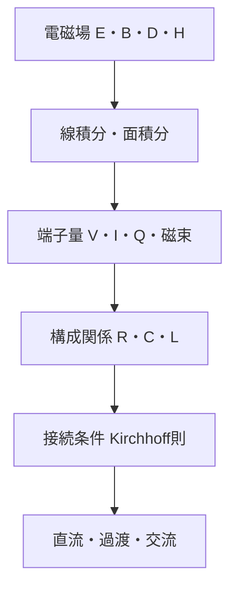

# part04_from_fields_to_circuits――場から回路へ

## このパートの問い

- 電圧は電場の何をまとめた量か。
- 電流は電流密度の何をまとめた量か。
- 抵抗・容量・インダクタンスは材料と形状からどう出るか。
- Kirchhoff則はMaxwell方程式のどの近似か。
- Poynting流束と端子電力はどう対応するか。

この図は、場の自由度を端子量へ圧縮し、どこで近似が入るかを示す。

## 学習順序

1. [電場から電圧へ](01_voltage_from_electric_field.md)
2. [電流密度から電流へ](02_current_from_current_density.md)
3. [局所Ohm則から抵抗へ](03_resistance_from_local_ohms_law.md)
4. [Gauss則と誘電体から容量へ](04_capacitance_from_gauss_and_dielectrics.md)
5. [磁束とFaraday則からインダクタンスへ](05_inductance_from_flux_and_faraday.md)
6. [Maxwell方程式からKirchhoff則へ](06_kirchhoff_laws_from_maxwell.md)
7. [集中定数近似](07_lumped_element_approximation.md)
8. [Poyntingベクトルと回路電力](08_power_and_poynting_flow.md)
9. [回路理論が破綻するとき](09_when_circuit_theory_breaks_down.md)

回路理論はMaxwell方程式と無関係な別体系ではない。空間に分布する場を、少数の端子量へ圧縮した有効モデルである。寸法、伝播時間、放射、寄生成分が無視できなくなれば、この圧縮を解いて場または分布定数モデルへ戻る。

## ナビゲーション

- 前：[現象論](../part03_phenomenology/README.md)
- 次：[回路応用](../part05_circuit_applications/README.md)
- 親：[電磁気学概要](../00_overview.md)
