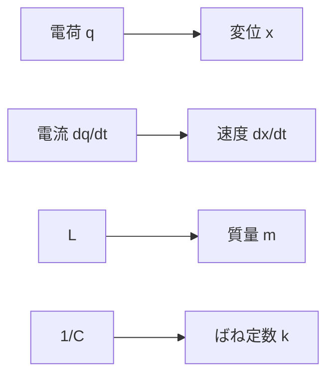

# LC・RLC振動――電場と磁場のエネルギー交換

## このページで答える問い

コンデンサとコイルの場エネルギー交換が、なぜ力学のばね振動と同じ式になるか。

## 前提知識と到達目標

二階ODEとエネルギー保存を前提とし、固有振動、減衰、強制振動、共振器への接続を説明できることを目標とする。

## 現象から見る

LC回路では電荷が最大のとき電場エネルギーが最大、電流が最大のとき磁場エネルギーが最大となり、二つが往復する。

この図は、LCと力学振動の対応を示す。

## モデル・定義・導出

理想LCの電荷について

$$
L\frac{d^2q}{dt^2}+\frac{q}{C}=0
$$
なので

$$
\omega_0=\frac{1}{\sqrt{LC}}
$$
である。エネルギーは

$$
U=\frac{q^2}{2C}+\frac12Li^2
$$
で一定。直列RLCでは

$$
L\ddot q+R\dot q+\frac{q}{C}=V(t)
$$
となり、質量、粘性抵抗、ばね定数との対応は

$$
m\leftrightarrow L,\qquad b\leftrightarrow R,\qquad k\leftrightarrow1/C
$$
である。損失が小さいと減衰振動、外力があると強制振動となる。分布した電場・磁場の固有モードへ進むと共振器と電磁波につながる。

## 固有の例

L=10 mH、C=1.0 μFなら

$$
f_0=\frac{1}{2\pi\sqrt{LC}}\simeq1.59\,\mathrm{kHz}
$$
である。

## 適用範囲と検算

定数RLC、集中定数、線形範囲。周波数が自己共振や配線共振へ近づけば、寄生成分または分布モデルが必要。

## 回路図が省略したもの

場の空間モード、放射、部品損失の周波数依存を三つの定数へ縮約する。

## 典型的な誤解

エネルギーがコンデンサからコイルへ瞬間移動するのではない。周囲の電磁場を介した連続的な収支である。

## 演習

1. LC・RLC振動の定義を、局所的な場または保存量との関係で説明せよ。
2. 中心式を導け。
3. 本文の数値例で入力値を半分にした場合を計算せよ。
4. このページの集中定数近似が妥当になる条件を一つ、破綻する条件を一つ挙げよ。
5. 次の説明を修正せよ。「エネルギーがコンデンサからコイルへ瞬間移動するのではない周囲の電磁場を介した連続的な収支である」
6. エネルギーまたは電力の収支を説明せよ。

## 全解答

### 1

LC・RLC振動は、端子量の接続条件と素子の構成関係を組み合わせた有効モデルである。
### 2

本文のKCL・KVLまたは構成関係から、暗記公式を使わず導く。
### 3

本文の中心式へ代入し、線形量と二乗量の違いに注意して求める。
### 4

定数RLC、集中定数、線形範囲。周波数が自己共振や配線共振へ近づけば、寄生成分または分布モデルが必要。
### 5

エネルギーがコンデンサからコイルへ瞬間移動するのではない。周囲の電磁場を介した連続的な収支である。
### 6

端子電力、場への蓄積、Joule損失、機械出力、放射のうち該当する項に分けて収支を書く。

## 学習チェック

- 中心式をMaxwell方程式または保存則から説明できる。
- 数値例の単位・符号・極限を確認できる。
- 集中定数モデルを使える条件と、場へ戻る条件を言える。

## ナビゲーション

- 前：[05_rl_transient_response.md](05_rl_transient_response.md)
- 次：[07_ac_impedance_and_phasors.md](07_ac_impedance_and_phasors.md)
- 親：[part05入口](README.md)
