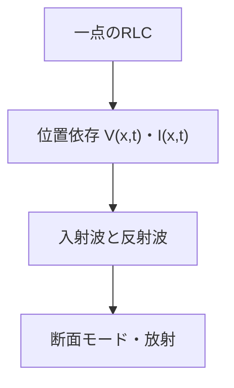

# 伝送線路――分布定数回路としての配線

## このページで答える問い

配線の長さを無視できないとき、電圧と電流はどのように波として伝わるか。

## 前提知識と到達目標

集中定数近似を前提とし、電信方程式、特性インピーダンス、反射、終端、定在波を説明できることを目標とする。

## 現象から見る

長い配線では、先端の負荷情報が瞬時に送信端へ届かない。各微小区間のL・Cが隣へエネルギーを渡し、電圧・電流波が進む。

この図は、集中定数から分布定数へ残す自由度が増えることを示す。

## モデル・定義・導出

単位長さ当たり

$$
R',\quad L',\quad G',\quad C'
$$
を持つ線路は

$$
\frac{\partial V}{\partial x}=-(R'+L'\partial_t)I,\qquad \frac{\partial I}{\partial x}=-(G'+C'\partial_t)V
$$
に従う。損失なしでは

$$
Z_0=\sqrt{\frac{L'}{C'}},\qquad v_p=\frac{1}{\sqrt{L'C'}}
$$
。負荷での反射係数は

$$
\Gamma_L=\frac{Z_L-Z_0}{Z_L+Z_0}
$$
である。整合

$$
Z_L=Z_0
$$
なら反射ゼロ、開放で正反射、短絡で負反射となる。入射波と反射波が重なると定在波が生じる。同軸や基板配線の電力は導体間誘電体中のPoynting流束として伝わる。

## 固有の例

50 Ω線路を100 Ωで終端すると

$$
\Gamma=(100-50)/(100+50)=1/3
$$
で、電圧波の3分の1が同相反射する。

## 適用範囲と検算

線路断面の単一伝播モードと均一な分布定数。コネクタ不連続、放射、複数モードでは局所モデルまたは全波解析が必要。

## 回路図が省略したもの

断面内の場分布を単位長さパラメータへ縮約するが、軸方向の分布は残す。

## 典型的な誤解

特性インピーダンスは線路の直流抵抗ではない。進行波の電圧電流比である。

## 演習

1. 伝送線路の定義を、局所的な場または保存量との関係で説明せよ。
2. 中心式を導け。
3. 本文の数値例で入力値を半分にした場合を計算せよ。
4. このページの集中定数近似が妥当になる条件を一つ、破綻する条件を一つ挙げよ。
5. 次の説明を修正せよ。「特性インピーダンスは線路の直流抵抗ではない進行波の電圧電流比である」
6. エネルギーまたは電力の収支を説明せよ。

## 全解答

### 1

伝送線路は、端子量の接続条件と素子の構成関係を組み合わせた有効モデルである。
### 2

本文のKCL・KVLまたは構成関係から、暗記公式を使わず導く。
### 3

本文の中心式へ代入し、線形量と二乗量の違いに注意して求める。
### 4

線路断面の単一伝播モードと均一な分布定数。コネクタ不連続、放射、複数モードでは局所モデルまたは全波解析が必要。
### 5

特性インピーダンスは線路の直流抵抗ではない。進行波の電圧電流比である。
### 6

端子電力、場への蓄積、Joule損失、機械出力、放射のうち該当する項に分けて収支を書く。

## 学習チェック

- 中心式をMaxwell方程式または保存則から説明できる。
- 数値例の単位・符号・極限を確認できる。
- 集中定数モデルを使える条件と、場へ戻る条件を言える。

## ナビゲーション

- 前：[10_motors_generators_and_back_emf.md](10_motors_generators_and_back_emf.md)
- 次：[12_antennas_and_radiation_connection.md](12_antennas_and_radiation_connection.md)
- 親：[part05入口](README.md)
