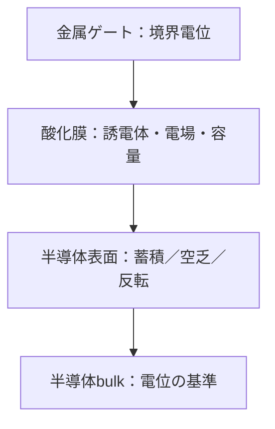

# MOSコンデンサ――誘電体と境界条件がチャネルの土台になる

## 構造と中心問題

MOSはMetal–Oxide–Semiconductorの略です。ゲート、絶縁酸化膜、半導体を積層し、酸化膜を横切る電場で半導体表面の電荷を変えます。

## 酸化膜容量と電圧分配

単位面積当たり

$$
C_{\mathrm{ox}}'=\frac{\varepsilon_{\mathrm{ox}}}{t_{\mathrm{ox}}}
$$

です。理想MOSでもゲート電圧は酸化膜電圧と表面電位へ分かれます。

$$
V_G=V_{\mathrm{fb}}+\psi_s-\frac{Q_s'}{C_{\mathrm{ox}}'}
$$

符号は電荷定義に依存するため、ここでは半導体側面電荷を

$$
Q_s'
$$

と明示します。flat-band電圧には仕事関数差と固定電荷が入ります。

## 蓄積・空乏・反転

p型基板を例にします。

- 負ゲート：正孔が表面へ蓄積。
- 小さな正ゲート：正孔が排除され、負のacceptorイオンが露出して空乏。
- 十分な正ゲート：電子が表面に増え、n型的な反転層を形成。

反転の厳密なしきい値にはFermi準位とキャリア統計が必要です。

## 数値例

比誘電率3.9、厚さ5 nmでは

$$
C_{\mathrm{ox}}'\approx6.91\times10^{-3}\ \mathrm{F/m^2}
$$

酸化膜に1 Vかかると

$$
E_{\mathrm{ox}}=2.0\times10^8\ \mathrm{V/m}
$$

です。薄膜では低い端子電圧でも巨大電場になるため、破壊とトンネル漏れが重要です。

## 界面と実デバイス

界面準位、固定酸化膜電荷、表面粗さはしきい値と移動度を変えます。high-k材料は同じ物理厚さで大きな容量を得て、直接トンネルを抑える狙いがあります。

## 演習と全解答

1. 酸化膜厚を10 nmから5 nmへ変えると容量密度は何倍か。  
   **解答**：2倍です。
2. 5 nm膜へ0.5 Vかけた電場を求めよ。  
   **解答**：
   $$
   E=1.0\times10^8\ \mathrm{V/m}
   $$
3. p型基板に正ゲートを加えた直後の三段階を述べよ。  
   **解答**：正孔の排除、空乏層形成、十分な電圧で電子反転層形成です。
4. ゲート電圧と表面電位が一致しない理由を述べよ。  
   **解答**：酸化膜にも電位降下があり、flat-band差と界面電荷も寄与するためです。
5. high-kの利点を容量式から説明せよ。  
   **解答**：誘電率を増やせば膜を厚くしても容量を維持でき、直接トンネルを抑えられます。
6. 電磁気学だけではしきい値を決めきれない理由を述べよ。  
   **解答**：反転キャリア密度と表面ポテンシャルの関係にバンド構造と統計が必要だからです。
7. 面積1平方マイクロメートルの5 nm膜の容量を求めよ。  
   **解答**：
   $$
   C=6.91\ \mathrm{fF}
   $$
8. 破壊電場を超える局所原因を一つ挙げよ。  
   **解答**：膜厚揺らぎや欠陥による電場集中です。

## ナビゲーション

- 前：[ダイオード](07_diode_from_field_to_terminal_model.md)
- 次：[MOSFET](09_mosfet_as_a_field_controlled_switch.md)
- 正本：[誘電体と容量](../part04_from_fields_to_circuits/04_capacitance_from_gauss_and_dielectrics.md)

## 参考資料

- S. M. Sze and K. K. Ng, *Physics of Semiconductor Devices*, MOS capacitor章。
- Y. Taur and T. H. Ning, *Fundamentals of Modern VLSI Devices*, electrostatics章。
