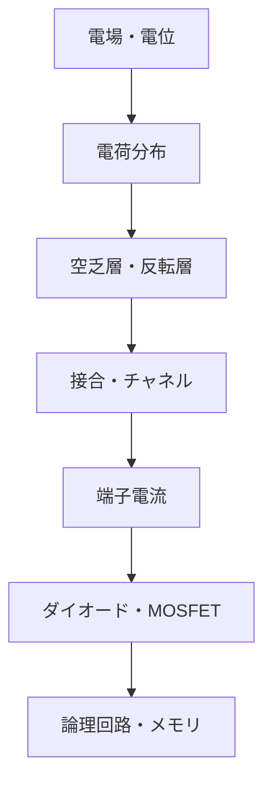

# part06 半導体への橋――電場で電荷を配置し、端子電流を制御する

> 位置：電磁気学で読める巨視的動作と、量子・統計力学へ保留する微視的理由の境界

## このパートの中心問題

- 導体・絶縁体・半導体の違いを、どこまで電磁気学で語れるか。
- 端子電圧が内部の電位・電荷分布をどう変えるか。
- MOSFETはなぜ電圧で電流を制御できるか。
- pn接合、MOS、論理回路、メモリはどうつながるか。

## 二段階で読む

第1段階では、Maxwell方程式、Poisson方程式、境界条件、容量、ドリフト・拡散、RC遅延、Joule発熱を使います。これで「電荷がどこへ集まり、端子から何が見えるか」を追えます。

第2段階では、バンド構造、状態密度、Fermi準位、Fermi–Dirac統計、有効質量、トンネル、量子閉じ込めが必要です。本パートでは結果を必要最小限だけ借り、導出は[統計力学](../../05_statistical_mechanics/00_overview.md)と[量子力学](../../07_quantum_mechanics/00_overview.md)へ保留します。

## 記号

電子の電荷を

$$
q_e=-e,\qquad e>0
$$

とします。電位を

$$
\phi
$$

とすると電子の静電ポテンシャルエネルギーは

$$
U_e=-e\phi
$$

です。電場は

$$
\mathbf E=-\nabla\phi
$$

です。電子の移動方向と慣用電流の向きは逆です。

## 記事一覧

1. [電磁気学と量子力学の分業](01_why_semiconductors_need_em_and_quantum.md)
2. [電位とキャリア制御](02_electric_potential_and_carrier_control.md)
3. [半導体中のPoisson方程式](03_poisson_equation_in_semiconductors.md)
4. [ドリフト・拡散・電流](04_drift_diffusion_and_current.md)
5. [ドーピング・空乏層・接合電場](05_doping_depletion_and_junction_fields.md)
6. [pn接合](06_pn_junction_as_an_electrostatic_structure.md)
7. [ダイオードの端子モデル](07_diode_from_field_to_terminal_model.md)
8. [MOSコンデンサ](08_mos_capacitor.md)
9. [MOSFET](09_mosfet_as_a_field_controlled_switch.md)
10. [容量・漏れ・絶縁破壊](10_device_capacitance_leakage_and_breakdown.md)
11. [スイッチングエネルギーとRC遅延](11_switching_energy_and_rc_delay.md)
12. [古典像の限界](12_limits_of_the_classical_picture.md)

## ナビゲーション

- 前：[回路応用](../part05_circuit_applications/README.md)
- 次：[現代の半導体製品](../part07_semiconductor_products/README.md)
- 親：[電磁気学](../00_overview.md)
