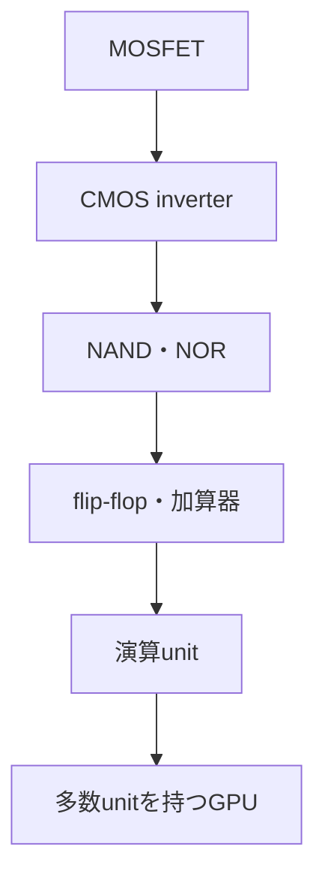

# CMOS論理からGPUの多数演算器へ

## MOSFETからBooleanへ

CMOS inverterはpMOSのpull-upとnMOSのpull-downを組み合わせます。NAND、NORを構成し、flip-flop、register、加算器へ積み上げます。論理機能の正本は[Logic Tower](../../../logic_tower/90_essays/hardware_and_sat/README.md)に置き、ここでは物理コストを見ます。

## GPU

GPUは多数の演算laneを同種の仕事へ並列投入します。SIMD/SIMTは実行モデルの概観であり、性能はトランジスタ数だけでは決まりません。clock、電力、配線、cache、HBM帯域、同期、softwareが効きます。

## 数値例

1演算に4 byteを2個読み4 byteを書き、演算が2 FLOPならデータ移動は12 byte、arithmetic intensityは

$$
\frac{2}{12}\approx0.167\ \mathrm{FLOP/byte}
$$

です。帯域1 TB/sでも上限は約0.167 TFLOP/sで、演算器のpeakが高くてもmemory-boundです。

## 演習と全解答

1. CMOS静止時の理想電流が小さい理由を述べよ。  
   **解答**：定常論理状態ではpull-upとpull-downの一方がoffだからです。
2. 実際の静止電力がゼロでない理由を述べよ。  
   **解答**：subthreshold、接合、gateなどの漏れがあるためです。
3. 上の例で演算を24 FLOPへ増やした強度を求めよ。  
   **解答**：2 FLOP/byteです。
4. トランジスタ数だけで性能を比較できない理由を二つ挙げよ。  
   **解答**：電力・clock制約と、メモリ・配線ボトルネックです。
5. Boolean NANDとNAND flashを区別せよ。  
   **解答**：前者は論理関数、後者はセルを直列接続する不揮発メモリ方式です。
6. GPUが全処理でCPUより速いと断定できるか。  
   **解答**：できません。並列度、分岐、データ移動、遅延要求に依存します。

## ナビゲーション

- 前：[階層比較](01_logic_memory_and_storage.md)
- 次：[SRAM](03_sram_and_cache.md)
- 論理正本：[論理ゲート](../../../logic_tower/90_essays/hardware_and_sat/01_logic_gates.md)
