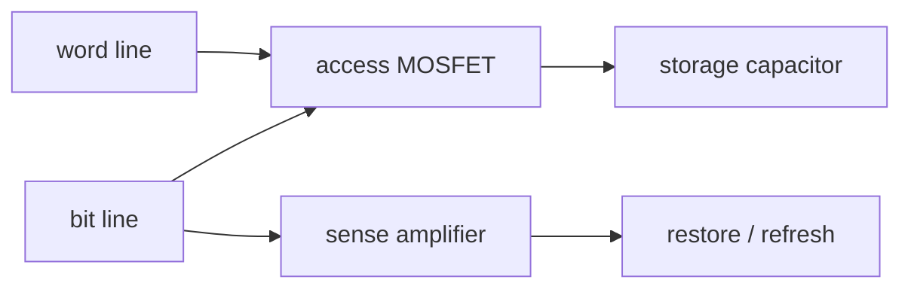

# DRAM――1 transistor＋1 capacitorで電荷を読む

## cellと配線

1T1C cellはaccess transistorとstorage capacitorから成ります。word lineがtransistorを開き、bit lineとcellを接続します。

## 読出し

bit lineを事前充電し、cellを接続すると電荷共有で微小電圧差が生まれます。sense amplifierが差をrailへ増幅します。読み出しはcell電荷を乱すため、増幅結果を書き戻します。漏れで電荷が減るためrefreshも必要です。

電荷は

$$
Q=CV
$$

です。cell容量が小さくなるほど保持電子数とsense marginが減ります。

## 数値例

$$
C_{\mathrm{cell}}=20\ \mathrm{fF},\qquad V=1.2\ \mathrm V
$$

なら

$$
Q=24\ \mathrm{fC}
$$

電子数換算は

$$
N=\frac{Q}{e}\approx1.5\times10^5
$$

です。bit line容量を200 fF、初期差を1.2 Vとする単純電荷共有なら電圧変化は約0.109 Vです。

## arrayと製品

rowはword line、columnはbit lineで選択します。bank化とburst転送で並列性を上げます。DDRはboard上の比較的狭いinterface、HBMは積層dieと広幅interfaceでbandwidthを上げます。

## 誤解

DRAMは単に「速いメモリ」ではありません。微小容量、漏れ、RC、sense、refresh、配線ノイズの設計問題です。保持時間を決める漏れ機構の一部は量子・欠陥物理を要します。

## 演習と全解答

1. cell容量を10 fFに半減すると同電圧の電荷はどうなるか。  
   **解答**：12 fC、約7.5万電子へ半減します。
2. refreshが必要な理由を述べよ。  
   **解答**：接合・transistor・誘電体などの漏れでstorage電荷が減るためです。
3. destructive readの意味を述べよ。  
   **解答**：bit lineとの電荷共有で元のcell状態が変わり、restoreが必要なことです。
4. sense amplifierの役割を述べよ。  
   **解答**：微小差を論理レベルへ増幅し、cellへ書き戻します。
5. bit line容量が大きいとsignalが小さくなる理由を式で示せ。  
   **解答**：
   $$
   \Delta V\approx\frac{C_{\mathrm{cell}}}{C_{\mathrm{cell}}+C_{\mathrm{BL}}}V
   $$
6. DRAMとSRAMのcell差を述べよ。  
   **解答**：DRAMは1T1C電荷、SRAMは交差結合latchです。
7. HBMもrefreshが必要か。  
   **解答**：HBMはDRAMなので必要です。controllerが規格に沿って管理します。
8. 電磁気学で読める範囲を述べよ。  
   **解答**：容量、電荷共有、RC、漏れ電流の端子効果、sense margin、配線結合です。

## ナビゲーション

- 前：[SRAM](03_sram_and_cache.md)
- 次：[NAND](05_nand_flash_and_floating_gate_or_charge_trap.md)
- 後：[HBM](07_hbm_and_vertical_integration.md)

## 参考資料

- [Micron: Introduction to Memory](https://www.micron.com/content/dam/micron/educatorhub/intro-to-memory/micron-intro-to-memory-presentation.pdf)（確認日：2026-07-26）。
- B. Jacob, S. Ng, and D. Wang, *Memory Systems: Cache, DRAM, Disk*。
