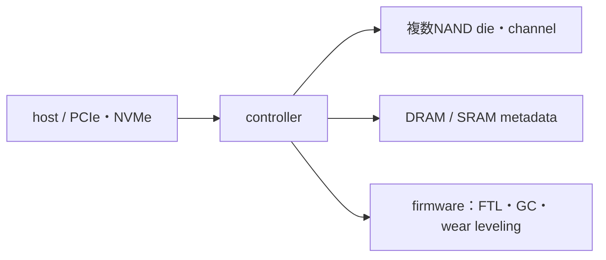

# SSD――NAND dieをcontrollerとfirmwareで使える記憶装置にする

## 構成

controllerはlogical blockを物理pageへ対応させ、ECC、bad block、wear leveling、garbage collection、over-provisioningを管理します。NANDはpage単位でprogramし、より大きいblock単位でeraseする非対称性があるためです。

## 性能指標

- latency：一要求の待ち時間。
- throughput：単位時間の総転送量。
- IOPS：小さなrandom I/Oの回数。
- endurance：書込み総量やdrive writes per day。
- QoS：tail latencyの安定性。

enterprise SSDは電力断保護、endurance、firmware検証、telemetry、QoSなども重視します。

## 数値例

4 channelを各800 MB/sで完全並列に使う理想bandwidthは

$$
4\times800=3200\ \mathrm{MB/s}
$$

です。interface、controller、protocol、workloadで下がります。

## 演習と全解答

1. SSDとNANDメーカーの役割差を述べよ。  
   **解答**：NANDはmemory die、SSDはcontroller・firmware・package・interfaceまで統合したsystemです。
2. garbage collectionが必要な理由を述べよ。  
   **解答**：上書き前に有効pageを移し、block単位でeraseして空きblockを作るためです。
3. over-provisioningの効果を述べよ。  
   **解答**：予備領域によりGC、wear leveling、bad block置換を容易にします。
4. 8 channelなら上の理想bandwidthはいくらか。  
   **解答**：6400 MB/sです。
5. ECCがNANDに特に重要な理由を述べよ。  
   **解答**：多値化、保持劣化、read disturb、program/erase劣化でraw errorが生じるためです。
6. throughputが高くてもlatencyが悪い場合を述べよ。  
   **解答**：大量並列処理で総量は出るが、GCやqueueで個別要求が長く待つ場合です。

## ナビゲーション

- 前：[NAND](05_nand_flash_and_floating_gate_or_charge_trap.md)
- 次：[HBM](07_hbm_and_vertical_integration.md)

## 参考資料

- [Micron: What is an SSD?](https://www.micron.com/about/micron-glossary/solid-state-drives)（確認日：2026-07-26）。
- NVM Express, [NVMe specifications](https://nvmexpress.org/specifications/)（確認日：2026-07-26）。
