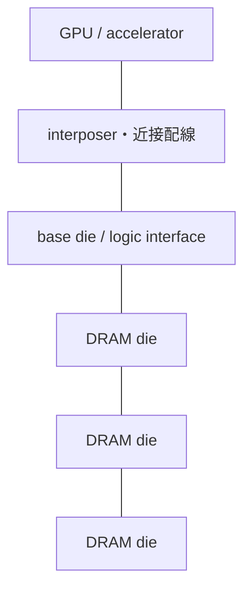

# HBM――広いI/O、積層、短い配線でbandwidthを作る

## 構造

HBMはDRAM dieを積層し、TSVと微細接続で垂直に結び、base dieを介してaccelerator近傍へ置く3D-stacked SDRAMです。

## DDRとの差

DDRは比較的狭いbusを高い転送率でboard上へ伸ばします。HBMは非常に広いinterfaceを短く並列に接続し、低いenergy/bitと高bandwidthを狙います。Micron公式説明ではHBM cubeの例として1024-bit幅・32 channelが示されています。

bandwidthは概念的に

$$
B=(\text{bit幅})\times(\text{転送率})
$$

です。広幅化だけでなく独立channelとbank並列性が効きます。

## trade-off

- TSV・接続の歩留まり。
- 積層による熱抵抗と温度勾配。
- known-good-die検査。
- package・interposer面積。
- GPUとの共同設計とsignal/power integrity。

## 数値例

1024 bit幅、pin当たり3.2 Gb/sなら理想値は

$$
B=\frac{1024\times3.2}{8}=409.6\ \mathrm{GB/s}
$$

です。protocol overheadとaccess効率を除くraw値です。

## 演習と全解答

1. 2048 bit幅、同じ転送率ならbandwidthはいくらか。  
   **解答**：819.2 GB/sです。
2. HBMが単なる「clockの速いDRAM」でない理由を述べよ。  
   **解答**：広幅I/O、独立channel、die積層、近接実装でbandwidthとenergy/bitを作るためです。
3. 配線を短くする利点を二つ挙げよ。  
   **解答**：容量・損失を減らし、反射・遅延・I/O energyを抑えます。
4. 積層数を増やす不利を二つ挙げよ。  
   **解答**：熱除去と総合歩留まり・接続信頼性です。
5. HBMはNANDか。  
   **解答**：違います。HBMは揮発性DRAMです。
6. base dieの役割を述べよ。  
   **解答**：stack内channelや外部interface、test・repairなどを接続・制御します。実装は世代で異なります。
7. raw bandwidthと実効bandwidthを区別せよ。  
   **解答**：rawはbit幅×転送率、実効はcommand、refresh、access patternなどを差し引いた値です。
8. HBMの熱問題が電磁気学だけで閉じない理由を述べよ。  
   **解答**：発熱源は電力から求められても温度場には熱伝導・流体・材料界面が必要です。

## ナビゲーション

- 前：[SSD](06_ssd_controller_and_nand_system.md)
- 次：[GPUと帯域](08_gpu_memory_bandwidth_and_ai.md)
- 公式概説：[Micron HBM](https://www.micron.com/products/memory/hbm)
