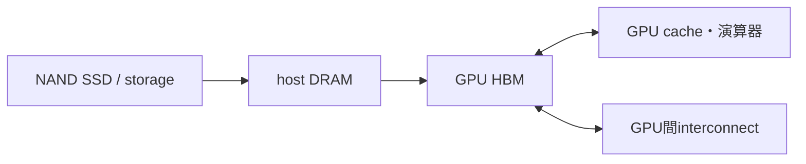

# GPU・メモリ帯域・AI workload

## rooflineの見方

演算性能上限を

$$
P_{\mathrm{peak}}
$$

メモリbandwidthを

$$
B
$$

arithmetic intensityを

$$
I_{\mathrm A}
$$

とすれば、単純上限は

$$
P\leq\min(P_{\mathrm{peak}},BI_{\mathrm A})
$$

です。前者が支配すればcompute-bound、後者ならmemory-boundです。

## AIで動くもの

- parameter：重み。
- activation：各layerの中間値。
- gradient・optimizer state：主に学習。
- KV cache：autoregressive推論で過去tokenのkey/value。
- dataset・checkpoint：SSDやnetwork storageから供給・保存。

cacheは再利用を増やしHBM trafficを減らします。複数GPUではNVLinkやnetworkのcollective通信も別のroofになります。

## 数値例

peak 100 TFLOP/s、HBM 2 TB/s、強度20 FLOP/byteなら

$$
BI_{\mathrm A}=40\ \mathrm{TFLOP/s}
$$

なのでmemory-boundの上限です。強度100なら帯域側は200 TFLOP/sとなり、peak側100 TFLOP/sが上限です。

## 演習と全解答

1. 強度50 FLOP/byte、帯域2 TB/sの帯域上限を求めよ。  
   **解答**：100 TFLOP/sです。
2. cache hitが性能を上げる理由を述べよ。  
   **解答**：遠いHBMから同じデータを再取得するbyte数を減らすためです。
3. SSDをHBMの代わりに直接使いにくい理由を述べよ。  
   **解答**：latency・bandwidth・access粒度が演算器近傍作業メモリに適さないためです。
4. KV cacheが推論で増える軸を述べよ。  
   **解答**：batch、sequence length、layer、head寸法などです。
5. peak FLOPSが同じでも性能差が出る理由を二つ挙げよ。  
   **解答**：memory/interconnect帯域と、software・utilizationの差です。
6. trainingとinferenceで同じbottleneckと断定できるか。  
   **解答**：できません。batch、model、precision、sequence、parallelismで変わります。

## ナビゲーション

- 前：[HBM](07_hbm_and_vertical_integration.md)
- 次：[信号品質と電力](09_interconnects_signal_integrity_and_power.md)

## 参考資料

- S. Williams, A. Waterman, and D. Patterson, “Roofline: An Insightful Visual Performance Model”。
- [NVIDIA Data Center](https://www.nvidia.com/en-us/data-center/)（確認日：2026-07-26）。
