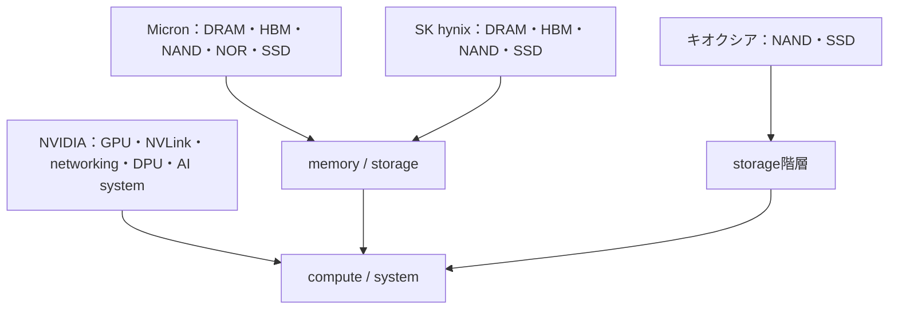

# 企業マップ――製品階層のどこを担当するか

> 確認日：2026-07-26  
> 方針：各社公式一次資料で製品カテゴリを確認。未公表の供給関係、順位、独占、将来出荷は断定しない。

## 分業図

## キオクシア

1. **製品**：NAND flash、BiCS FLASH 3D NAND、client・enterprise・data center向けSSD、UFS/e-MMC。  
2. **役割**：不揮発storage。  
3. **物理**：電荷蓄積、しきい値、トンネル、絶縁、3D配線。  
4. **device**：charge-trap系を含むNAND cell、controllerを含むSSD。  
5. **製造・実装**：3D積層、NAND die、package。  
6. **他社接続**：CPU/GPU systemからPCIe等を介してdataset・checkpointを供給。  
7. **誤解**：HBM supplierとして扱わない。NAND dieとSSDを同一視しない。  
8. **一次資料**：[Memory](https://www.kioxia.com/en-jp/business/memory.html)、[BiCS FLASH](https://www.kioxia.com/en-jp/business/memory/bics.html)。  
9. **確認日**：2026-07-26。

## Micron

1. **製品**：DRAM、HBM、graphics memory、NAND、NOR、SSD。  
2. **役割**：揮発memoryから不揮発storageまで。  
3. **物理**：DRAM容量・refresh、HBM広幅I/O、NAND電荷保持。  
4. **device**：DRAM cell、HBM stack、flash cell。  
5. **製造・実装**：memory wafer製造、die積層・module・drive。  
6. **他社接続**：CPU、GPU、data center、edge、consumer、automotive systemへ供給。  
7. **誤解**：HBMとSSDは同じ用途ではない。  
8. **一次資料**：[Memory products](https://www.micron.com/products/memory)、[HBM](https://www.micron.com/products/memory/hbm)、[NAND](https://www.micron.com/products/storage/nand-flash)。  
9. **確認日**：2026-07-26。

## SK hynix

1. **製品**：DRAM、HBM、NAND、client・enterprise SSD、CXL memoryなど。  
2. **役割**：AI accelerator近傍bandwidth、system memory、storage。  
3. **物理**：DRAM容量、TSV・積層、熱、NAND保持。  
4. **device**：DRAM/HBM stack、NAND cell、SSD controllerを含むsolution。  
5. **製造・実装**：memory製造、HBM積層・advanced packaging、3D NAND。  
6. **他社接続**：GPUなどの計算chipと組み合わせる補完関係。個別供給は公式発表がある場合だけ特定する。  
7. **誤解**：「AI memory」はGPUそのものではない。  
8. **一次資料**：[Company products](https://www.skhynix.com/company/UI-FR-CP02/)、[2026 AI memory overview](https://news.skhynix.com/en/hbm-to-essd/)。  
9. **確認日**：2026-07-26。

## NVIDIA

1. **製品**：GPU、accelerated computing platform、NVLink/NVLink Switch、networking、BlueField DPU、HGX/DGXなどAI system。  
2. **役割**：演算、GPU間通信、network・infrastructure offload、system統合。  
3. **物理**：CMOS switching、配線RC、signal/power integrity、HBM interface、熱。  
4. **device**：logic GPU・switch・DPU。HBM cell自体とは別。  
5. **製造・実装**：architecture・chip/system設計とpackage統合。製造分業の個別関係は本記事の対象外。  
6. **他社接続**：memory企業のHBM、server、storage、network ecosystemと統合。  
7. **誤解**：NVIDIAとmemoryメーカーは単純競合ではなく、GPUとHBMは別役割。  
8. **一次資料**：[Data center](https://www.nvidia.com/en-us/data-center/)、[NVLink](https://www.nvidia.com/en-us/data-center/nvlink/)、[BlueField DPU](https://www.nvidia.com/en-us/networking/products/data-processing-unit/)、[HGX](https://www.nvidia.com/en-us/data-center/hgx/)。  
9. **確認日**：2026-07-26。

## 演習と全解答

1. NVIDIAとHBMメーカーを競合だけで表せない理由を述べよ。  
   **解答**：GPU演算chipと近傍memoryを供給し合う補完的な異層だからです。
2. キオクシアをこの4社比較で主にどこへ置くか。  
   **解答**：NANDとSSDによる不揮発storage層です。
3. MicronとSK hynixが複数層を担当する例を述べよ。  
   **解答**：DRAM/HBMの揮発memoryとNAND/SSDの不揮発storageです。
4. 「NVIDIA製HBM」と断定してよいか。  
   **解答**：GPU systemにHBMを統合しても、memory dieの供給企業とは区別すべきです。
5. 企業順位を載せなかった理由を述べよ。  
   **解答**：物理・分業理解が目的で、時点・指標で変動し一次資料だけでは厳密比較しにくいためです。
6. 供給関係を記述する条件を述べよ。  
   **解答**：当事者の公式発表で対象製品・時点・範囲を確認できる場合です。
7. SSDとHBMを階層へ配置せよ。  
   **解答**：SSDは永続storage、HBMはaccelerator近傍の揮発作業memoryです。
8. 同じ企業が複数層を持つ利点を一つ述べよ。  
   **解答**：device、package、firmwareを協調最適化できますが、全層を単独で完結する意味ではありません。

## ナビゲーション

- 前：[製造](11_semiconductor_manufacturing_overview.md)
- 次：[AIデータセンター](13_from_device_physics_to_ai_datacenter.md)
