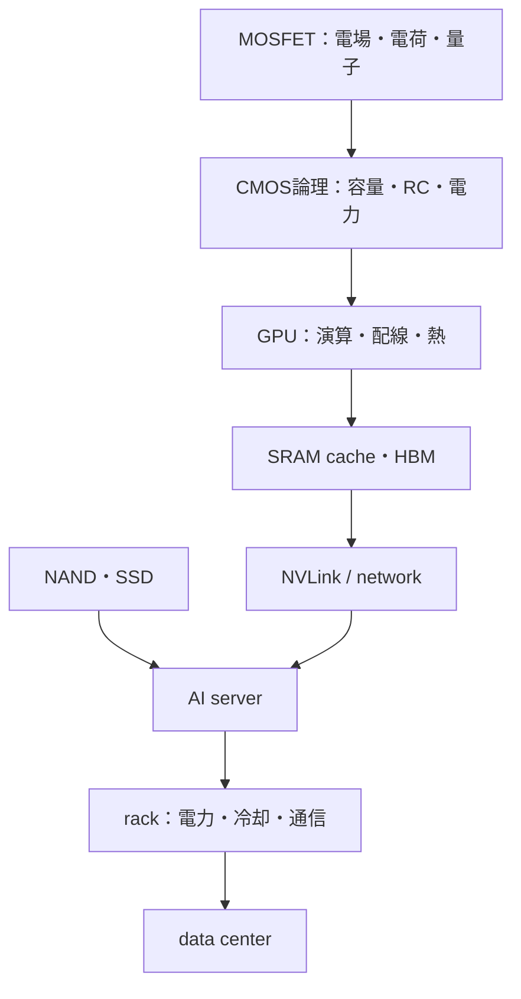

# MOSFETからAIデータセンターまで

## 全体像

## 層ごとの主役

| 層 | 重要な物理・工学 |
|---|---|
| MOSFET | 電位、Poisson、反転、トンネル |
| 配線 | 抵抗、容量、inductance、伝送線路 |
| GPU | switching電力、signal、並列architecture |
| SRAM/HBM | cell保持、sense、TSV、熱 |
| network | transmission line、光、電磁波 |
| SSD | NAND、トンネル、ECC、firmware |
| data center | power delivery、変換損失、冷却、通信 |

## data path

学習dataとcheckpointはSSD・storageに永続化され、host memoryを経てGPU HBMへ移ります。GPU内ではcacheとregisterが再利用を支えます。複数GPUのgradientやactivationはNVLink・networkを通ります。計算結果は再びstorageへ戻ります。

## 数値例

8 GPUが各700 W、network・CPU・memory等が3 kWならserverは

$$
P=8\times700+3000=8600\ \mathrm W
$$

です。100台ならIT負荷だけで860 kWです。これは仮想例で、実製品値やfacility overheadとは分けます。

## 演習と全解答

1. modelをSSDからGPUへ読む途中の階層を並べよ。  
   **解答**：SSD/storage、host I/O・DRAM、GPU interconnect、HBM、cache/registerです。
2. 100台例でPUE 1.2ならfacility電力を求めよ。  
   **解答**：
   $$
   860\ \mathrm{kW}\times1.2=1.032\ \mathrm{MW}
   $$
3. networkが遅いと多GPU学習が止まる理由を述べよ。  
   **解答**：collective通信完了を待つ同期区間で演算器がidleになるためです。
4. HBM容量不足をSSD bandwidthだけで補えない理由を述べよ。  
   **解答**：latency・bandwidth・access粒度が大きく異なるためです。
5. data center冷却をJoule則だけで設計できるか。  
   **解答**：発熱源は見積もれても、熱伝導・対流・流体・設備制御が必要です。
6. 電磁気学へ戻る三つの場所を挙げよ。  
   **解答**：MOS gate、high-speed interconnect、power deliveryです。
7. 量子力学へ戻る二つの場所を挙げよ。  
   **解答**：transistorのband/トンネルと、NAND program・retentionです。
8. 企業と物理を混同しない説明を書け。  
   **解答**：企業は複数層の製品を設計・製造・統合し、各製品内で同じ物理法則が異なる役割を果たします。

## まとめ

AI計算基盤は「GPU一個」ではありません。電場で作るtransistor、容量で保持するmemory、電磁波として伝わるsignal、抵抗で生じる熱、storageとnetworkの階層を統合したsystemです。

## ナビゲーション

- 前：[企業マップ](12_company_map_kioxia_micron_skhynix_nvidia.md)
- 親：[part07入口](README.md)
- 章入口：[電磁気学](../00_overview.md)
