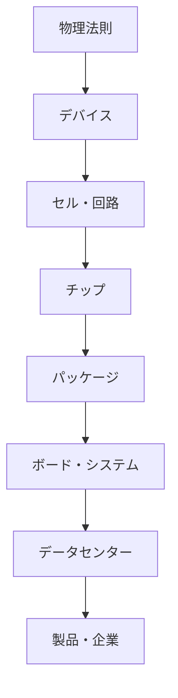

# part07 現代の半導体製品――デバイスからAIデータセンターまで

## 階層を混ぜない

NVIDIAのGPUと、Micron・SK hynixなどのHBMは異なる層を担当します。キオクシアなどのNANDとSSDも、演算器の近傍メモリとは役割が違います。企業名を物理法則や単一デバイスと同一視せず、設計、製造、メモリ供給、実装、システム構築を分けます。

## 記事一覧

1. [ロジック・メモリ・ストレージ](01_logic_memory_and_storage.md)
2. [CMOS論理とGPU](02_cmos_logic_and_gpu_switching.md)
3. [SRAMとcache](03_sram_and_cache.md)
4. [DRAM](04_dram_as_a_transistor_capacitor_cell.md)
5. [NAND flash](05_nand_flash_and_floating_gate_or_charge_trap.md)
6. [SSD](06_ssd_controller_and_nand_system.md)
7. [HBM](07_hbm_and_vertical_integration.md)
8. [GPU・帯域・AI](08_gpu_memory_bandwidth_and_ai.md)
9. [信号品質と電力](09_interconnects_signal_integrity_and_power.md)
10. [package・TSV・chiplet・熱](10_packaging_tsv_chiplets_and_thermal_limits.md)
11. [製造工程](11_semiconductor_manufacturing_overview.md)
12. [企業マップ](12_company_map_kioxia_micron_skhynix_nvidia.md)
13. [AIデータセンターまで](13_from_device_physics_to_ai_datacenter.md)

## ナビゲーション

- 前：[半導体への橋](../part06_semiconductor_bridge/README.md)
- 親：[電磁気学](../00_overview.md)
- Q&A：[製品比較](../qa/07_memory_product_comparison.md)
