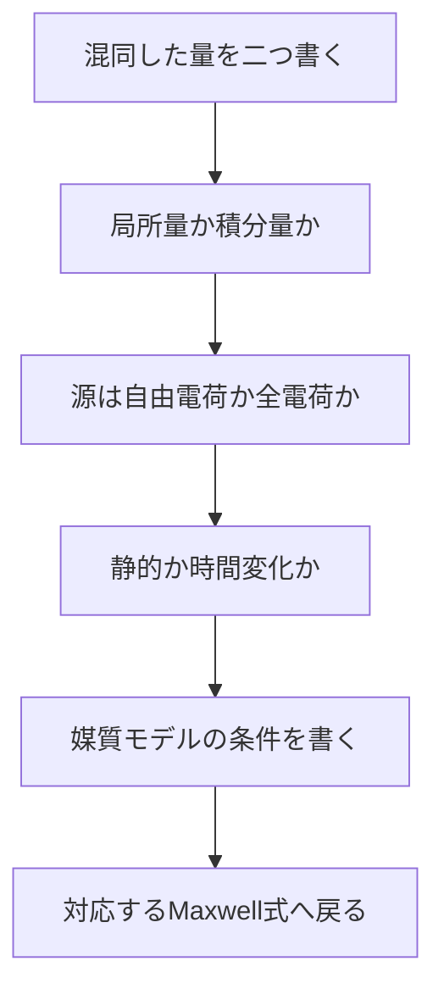

# 電磁気学の頻出誤解14問――似た概念を分離する

> 章内位置：14 / 15「誤解の整理」
> 使い方：各節の「誤解→修正→確認式」を1組として読む

## 1. 電位と電場は同じか

電位

$$
\phi
$$

は単位電荷あたりの位置エネルギーでスカラーです。静電場では

$$
\mathbf{E}=-\nabla\phi
$$

です。同じ電位の場所でも、その周囲の傾きが違えば電場は違います。

時間変化場では一般に

$$
\mathbf{E}=-\nabla\phi-\frac{\partial\mathbf{A}}{\partial t}
$$

であり、電場全体を一つのスカラー電位差だけでは表せません。

## 2. 電束と電場は同じか

電場は各点のベクトルです。面

$$
S
$$

を貫く電束は

$$
\Phi_E=\int_S\mathbf{E}\cdot d\mathbf{S}
$$

で、選んだ面に依存する積分量です。電束ゼロでも電場が各点でゼロとは限りません。

## 3. 電束密度と電場は同じか

電場は全電荷が作り、荷電粒子に力を及ぼします。電束密度は

$$
\mathbf{D}=\varepsilon_0\mathbf{E}+\mathbf{P}
$$

により、物質の分極を整理して自由電荷を源とする形へ書き換えた補助場です。

$$
\nabla\cdot\mathbf{E}=\frac{\rho_{\mathrm f}+\rho_{\mathrm b}}{\varepsilon_0}
$$

$$
\nabla\cdot\mathbf{D}=\rho_{\mathrm f}
$$

を対比します。

## 4. 電流は電子の速度か

電流は単位時間に断面を通過する電荷量です。

$$
I=\int_A\mathbf{J}\cdot d\mathbf{A}
$$

単一キャリア近似では

$$
\mathbf{J}=nq\mathbf{v}_{\mathrm d}
$$

ですが、ドリフト速度は信号や電磁エネルギーの伝搬速度ではありません。回路を閉じた後の場の変化は、導線に沿って電磁気的に伝わります。

## 5. 電圧があれば必ず電流が流れるか

流れません。開回路、絶縁体、充電済みコンデンサの定常状態などでは電圧があっても伝導電流はゼロになり得ます。

$$
\mathbf{J}_{\mathrm c}=\sigma\mathbf{E}
$$

は材料モデルであり、

$$
\sigma=0
$$

の理想絶縁体なら有限電場でも伝導電流はありません。時間変化があれば変位電流項は残り得ます。

## 6. 磁場は仕事をするか

点電荷への磁気力は

$$
\mathbf{F}_B=q\mathbf{v}\times\mathbf{B}
$$

なので瞬時仕事率は

$$
\mathbf{F}_B\cdot\mathbf{v}=0
$$

です。磁気力単独は点電荷の速さを変えません。ただし、磁場が時間変化して誘導電場を作る場合、エネルギーを与えるのは電場です。磁気材料や拘束された系のエネルギー交換を「磁場は何もできない」と単純化もしません。

## 7. Faraday則とLorentz力は同じか

固定された積分路では、時間変化する磁場が渦電場を作ります。

$$
\oint_C\mathbf{E}\cdot d\mathbf{l}=-\frac{d}{dt}\int_S\mathbf{B}\cdot d\mathbf{S}
$$

導体が磁場中を動く場合は電荷に

$$
q\mathbf{v}\times\mathbf{B}
$$

が働く運動起電力があります。動く回路の一般式は

$$
\mathcal{E}=\oint_C
\left(\mathbf{E}+\mathbf{u}\times\mathbf{B}\right)
\cdot d\mathbf{l}
$$

です。磁束則へまとめられる条件はありますが、機構を混同しません。

## 8. 電磁波では何が振動するか

媒質の物質粒子が波形そのものとして上下するとは限りません。真空中では電場と磁場が時間・空間的に振動します。

$$
\mathbf{E}\perp\mathbf{B}\perp\mathbf{k}
$$

線形・等方・損失なし媒質の進行平面波では、両者は同位相です。損失媒質では一般に位相関係が変わります。

## 9. Poyntingベクトルは導線の中だけを流れるか

ポインティングベクトルは

$$
\mathbf{S}=\mathbf{E}\times\mathbf{H}
$$

で、場が存在する空間のエネルギー流を表します。直流回路でも、抵抗へ入るエネルギーは周囲の空間から表面を横切って流入すると記述できます。「電子が導線内でエネルギーを荷物のように運ぶ」だけではありません。

## 10. 導体内部の電場は常にゼロか

静電平衡の理想導体内部ではゼロです。しかし有限導電率の導体に定常電流を流すには

$$
\mathbf{E}=\frac{\mathbf{J}}{\sigma}
$$

が必要です。交流では表皮効果を生む時間変化場も内部へ浸透します。「導体」「完全導体」「静電平衡」を区別します。

## 11. 表面電荷は余計な細部か

表面電荷は導体表面の境界条件を作り、導線に沿う内部電場の分布を調整します。曲がった導線や抵抗を含む回路で電流方向が変わるのも、表面電荷分布が場を形成するからです。

$$
\hat{\mathbf{n}}\cdot
(\mathbf{D}_{\mathrm{out}}-\mathbf{D}_{\mathrm{in}})=\sigma_{\mathrm f}
$$

は回路の局所構造と無関係な飾りではありません。

## 12. 静電場と時間変化する電場の違い

静電場は

$$
\nabla\times\mathbf{E}=\mathbf{0}
$$

で、単一値のスカラー電位を使えます。時間変化する磁場があると

$$
\nabla\times\mathbf{E}=-\frac{\partial\mathbf{B}}{\partial t}
$$

なので閉路積分がゼロとは限りません。

## 13. 電荷保存と変位電流は別々の追加法則か

Ampère–Maxwell則の発散を取ると

$$
0=\nabla\cdot\mathbf{J}_{\mathrm f}
+\frac{\partial\rho_{\mathrm f}}{\partial t}
$$

が得られます。変位電流項は、時間変化する電荷密度と磁場方程式を整合させます。電荷保存を「破る電流」ではありません。

## 14. 近傍場と遠方場は距離だけで機械的に分かれるか

距離を波長や源の大きさと比較します。遠方場の目安は

$$
R\gg\lambda
$$

かつ

$$
R\gg\text{源の大きさ}
$$

です。近傍場は主に

$$
1/R^2,\ 1/R^3
$$

放射場は

$$
1/R
$$

で減衰します。境界は突然切り替わる壁ではなく、支配項が入れ替わる領域です。

## 15. 復帰マップ

## 16. 確認問題

1. 電束ゼロだが電場が非ゼロの例を挙げよ。
2. 磁場中で円運動する点電荷の運動エネルギーが一定であることを示せ。
3. 開回路で電圧が非ゼロになれる理由を述べよ。
4. 導体内部の電場がゼロになる条件を限定して述べよ。
5. 電束密度を導入しても電場のガウス則が不要にならない理由を述べよ。
6. 近傍場と放射場を一文ずつで区別せよ。

## 17. 全解答

1. 一様電場中の任意の閉曲面では、入る束と出る束が等しく総電束はゼロですが、電場は非ゼロです。
2.

$$
\frac{dK}{dt}=q(\mathbf{v}\times\mathbf{B})\cdot\mathbf{v}=0
$$

です。
3. 回路が閉じていなければ定常な伝導電流の経路がなく、端子間に電位差だけを保持できます。
4. 静電平衡に達した理想導体または有限導体のバルクを考える場合です。電流中や交流中には一般化できません。
5. 電場は力と全電荷の関係を表し、電束密度は自由電荷と物質応答を整理する別の記述だからです。
6. 近傍場は源とエネルギーを往復させる急減衰成分、放射場は遠方へ有限電力を運ぶ

$$
1/R
$$

成分です。

## 回路で増える誤解

- 電圧は電場そのものではなく線積分であり、誘導場では測定経路が重要です。
- 電流は電子の速さではなく電流密度の断面積分です。
- 抵抗・容量・インダクタンスは普遍定数ではなく、材料・形状・境界条件を縮約した端子量です。
- Kirchhoff則はMaxwell方程式と無関係な法則ではなく、準静的近似を含む保存則です。
- 詳細は[場から回路へ](../part04_from_fields_to_circuits/README.md)で確認します。

## ナビゲーション

- 前：[Q&A入口](README.md)
- 次：[問題選択](02_problem_selection.md)
- 親：[電磁気学の全体像](../00_overview.md)
