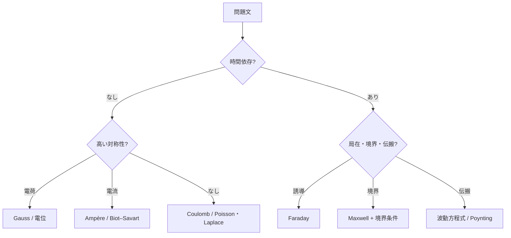

# 電磁気学の問題選択――どの道具を使うか

> 章内位置：13 / 15「問題の選び方」
> 目的：公式を思い出す前に、対称性・時間依存・媒質・境界・求める量を読む

## 1. 最初の5問

問題文を読んだら、次を余白に書きます。

1. 源は電荷、電流、時間変化する場のどれか。
2. 球・円筒・平面・並進の対称性があるか。
3. 静的、準静的、調和時間依存、一般時間依存のどれか。
4. 真空か、誘電体か、導体か。線形・等方・一様か。
5. 欲しいのは場、電位、力、エネルギー、流束、放射電力のどれか。

この図は最初の解法候補を選ぶための全体フローです。

## 2. 道具ごとの選択条件

### Coulomb積分

既知の静的電荷分布から直接電場を求めます。

$$
\mathbf{E}(\mathbf{r})=\frac{1}{4\pi\varepsilon_0}
\int
\rho(\mathbf{r}')
\frac{\mathbf{r}-\mathbf{r}'}
{|\mathbf{r}-\mathbf{r}'|^3}
d^3r'
$$

対称性が弱くても使えますが、ベクトル積分が重くなります。

### Gauss則

球・円筒・平面対称など、ガウス面上で場の大きさと向きが単純化できるときに最短です。法則自体は常に正しいですが、対称性が弱いと未知関数を積分外へ出せません。

### 電位

静電場で、スカラー積分がベクトル積分より簡単なときに使います。

$$
\phi(\mathbf{r})=\frac{1}{4\pi\varepsilon_0}
\int\frac{\rho(\mathbf{r}')}{|\mathbf{r}-\mathbf{r}'|}d^3r'
$$

最後に

$$
\mathbf{E}=-\nabla\phi
$$

とします。

### Poisson・Laplace方程式

境界の電位が与えられ、領域内の電位分布を求める問題に向きます。

$$
\nabla^2\phi=-\frac{\rho}{\varepsilon_0}
$$

電荷のない領域では

$$
\nabla^2\phi=0
$$

です。

### Ampère則

定常電流に円筒・平面・ソレノイド型の高い対称性があるときに使います。

$$
\oint_C\mathbf{B}\cdot d\mathbf{l}=\mu_0I_{\mathrm{enc}}
$$

一般時間依存では変位電流を含めます。

### Biot–Savart則

定常電流の形が既知で、Ampère積分路で場を定数として出せない場合に使います。有限直線、円形ループ、任意形状の細線電流が代表です。

### Faraday則

磁束の時間変化または回路運動が起電力を生む問題に使います。固定回路か移動回路かを区別します。

### Maxwell方程式

電場と磁場が相互に時間変化する、源・境界・物質応答が同時に現れる場合の出発点です。個別法則で閉じないときに戻る正本です。

### 境界条件

媒質が切り替わる面、導体表面、入射・反射・透過がある問題で使います。法線と接線を分解し、自由表面電荷・表面電流の有無を確認します。

### 波動方程式

均一領域の伝搬、固有モード、分散関係、減衰を求めます。源のない領域へMaxwell方程式を組み合わせて導きます。

### エネルギー保存・Poyntingベクトル

場を全部求めずに力・圧力・電力・損失を知りたい場合、または解を検算したい場合に有効です。

$$
\frac{\partial u}{\partial t}
+\nabla\cdot\mathbf{S}
+\mathbf{J}\cdot\mathbf{E}=0
$$

## 3. 代表問題の段階判定

### 例1：一様に帯電した球

- 静的
- 球対称
- 求める量は電場

したがってGauss則です。電位を求めるなら、電場を積分するかPoisson方程式も候補です。

### 例2：有限長直線電流

- 定常
- 軸対称は有限端で崩れる
- 電流形状が既知

したがってBiot–Savart則です。無限長近似が妥当ならAmpère則へ簡略化できます。

### 例3：接地された箱内の電位

- 静電場
- 領域内電荷なし
- 境界値が既知

したがってLaplace方程式と境界条件です。形状に応じて変数分離を使います。

### 例4：導体中の交流場

- 調和時間依存
- 損失媒質
- 伝搬と減衰

Maxwell方程式、Ohm則、複素波数を使います。良導体近似は比を評価してから入れます。

### 例5：アンテナ遠方の電力

- 時間依存する局在源
- 遠方場
- 求める量は放射電力

放射場を求め、Poyntingベクトルを球面積分します。

## 4. 「使える」と「便利」を分ける

Gauss則は非対称な系でも正しいですが、電場を直接解けないことがあります。Ampère–Maxwell則も常に正しいですが、積分路上の磁場が未知のままなら便利ではありません。

問題選択では

$$
\text{法則の成立条件}
$$

と

$$
\text{未知量を積分外へ出せる条件}
$$

を分離します。

## 5. 復帰手順

1. 図を描き、源と境界を色分けする。
2. 対称操作をしても配置が変わらないか確認する。
3. 静的か時間依存かを書く。
4. 求める量を一つに絞る。
5. 候補法則の未知量数と条件数を数える。
6. 最後に単位・符号・極限で検算する。

## 6. 演習問題

次の問題で第一候補の道具と理由を答えよ。

1. 無限平面電荷の電場。
2. 円形電流ループの軸上磁場。
3. 電荷のない長方形領域で、四辺の電位が指定された問題。
4. 時間変化する一様磁場内の円周に沿う電場。
5. 二つの誘電体境界での電場の屈折。
6. 真空平面波の伝搬速度。
7. 抵抗へ流入する電力。
8. 対称性のない静的体積電荷分布の電場。

## 7. 全解答

1. 平面対称なのでGauss則。
2. 有限ループではAmpère則だけで未知磁場を取り出せないためBiot–Savart則。
3. 電荷なしなのでLaplace方程式と境界条件。
4. Faraday則。円対称性で線積分から電場を取り出せます。
5. Maxwell方程式から導く境界条件。自由表面電荷の有無と構成方程式を確認します。
6. 真空中Maxwell方程式から波動方程式。
7. Poynting定理または

$$
\mathbf{S}=\mathbf{E}\times\mathbf{H}
$$

の面積分。
8. Coulomb積分。境界値が主ならPoisson方程式も候補です。

## 8. 学習チェック

- 対称性の有無を、見た目でなく不変変換で説明できる。
- 積分法則が正しいことと、計算を解けることを区別できる。
- 媒質・境界・時間依存を解法選択へ反映できる。

## 9. 回路問題を選ぶ追加分岐

- 部品寸法と配線長を波長・立上り時間に比べ、集中定数か分布定数かを先に決めます。
- 直流定常なら直並列・KCL・KVL、過渡なら初期値とODE、正弦波定常ならフェーザを選びます。
- 反射・放射・クロストークが問われるなら、伝送線路またはMaxwell方程式へ戻ります。
- 大学受験の選択フローは[回路問題戦略](04_high_school_circuit_problem_strategy.md)を参照してください。

## ナビゲーション

- 前：[頻出誤解](01_common_misconceptions.md)
- 次：[単位と符号](03_units_and_signs.md)
- 親：[Q&A入口](README.md)
