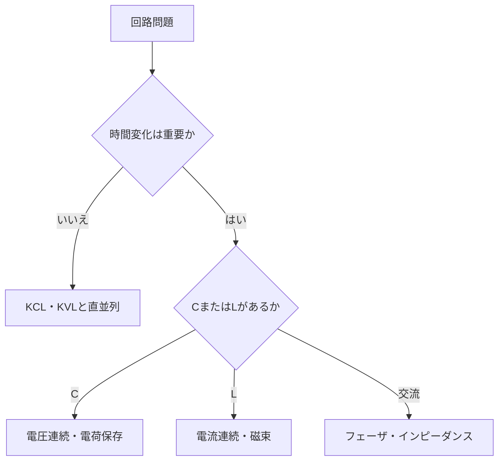

# 大学受験回路問題の解法戦略

## 最初に判定すること

1. スイッチの各区間で接続はどう変わるか。
2. 直流定常、過渡、交流のどれか。
3. コンデンサの電圧、コイルの電流など、瞬時に連続な量は何か。
4. 電源接続中か、孤立導体系か。
5. 失われた場の情報を無視できる集中定数問題か。

## 頻出テーマと背後の理論

| 大学受験のテーマ | 背後の電磁気学 | 省略したもの |
|---|---|---|
| 電場・電位 | 電場の線積分と静電ポテンシャル | 経路依存を生む誘導場 |
| 平行板コンデンサ | Gauss則・境界条件・誘電体 | 端効果 |
| 誘電体挿入 | 分極・電束密度・構成関係 | 分散・損失 |
| 抵抗値 | 局所Ohm則と幾何形状 | 電流密度分布・温度 |
| 直列・並列 | Kirchhoff則 | 蓄積電荷・鎖交磁束 |
| 電力 | Poynting定理とJoule損失 | 空間的な流束 |
| 電磁誘導 | Faraday則 | 回路外の場分布 |
| コイル | 自己インダクタンス | 漏れ磁束・寄生容量 |
| 交流回路 | 複素表示とインピーダンス | 過渡応答 |
| 共振 | 電場・磁場エネルギー交換 | 放射・分布モード |
| 変圧器 | 相互誘導 | 銅損・鉄損・漏れ |
| 電磁波 | Maxwell方程式の波動解 | 境界・媒質の詳細 |

## 三つの典型問題

### 抵抗回路

節点と閉路を先に決め、KCL・KVLと

$$
V=RI
$$

を組み合わせる。捨てた情報は抵抗内の場と配線遅延であり、回路寸法が波長より十分小さく、温度変化が小さいため許される。

### コンデンサ切替

切替直前・直後・十分後を分ける。孤立導体の電荷保存と

$$
Q=CV
$$

を使う。切替直後の電磁過渡を捨て、初期値と終状態だけを残している。

### コイル切替

有限電圧ならコイル電流は連続である。

$$
v_L=Lrac{di}{dt}
$$

開放時に電流経路がなければ理想モデルが破綻し、アークや寄生容量へエネルギーが移る。

## 演習と解答

1. 直流定常のコンデンサを開放、コイルを短絡とみなす条件を述べよ。
   **解答**：十分時間が経ち、理想素子で、Cの漏れとLの巻線抵抗を無視する条件。これは過渡や実損失を捨てた極限である。
2. 電圧計を並列、電流計を直列に入れる理由を述べよ。
   **解答**：測りたい端子電圧を共有し、測りたい枝電流を全て通すため。理想入力抵抗の極限も使う。
3. コンデンサ接続で静電エネルギーが減った。保存則との整合を述べよ。
   **解答**：Joule熱、過渡電磁場、放射へ移る。終状態だけの理想回路が経路を省略した。
4. 立上り1 ns、長さ1 mの配線を単なる線としてよいか。
   **解答**：伝播遅延が数ns級なので不可。伝送線路へ戻る。
5. 変圧器に直流を加え続ける誤りを説明せよ。
   **解答**：定常磁束では二次起電力がなく、一次は巻線抵抗と飽和で大電流になり得る。
6. 回路の電力が負になった意味を述べよ。
   **解答**：受動符号規約では素子が外部へ電力を供給している。電池、放電中C、回生機などが該当する。

## ナビゲーション

- 前：[回路応用](../part05_circuit_applications/README.md)
- 次：[工学応用マップ](05_engineering_application_map.md)
- 親：[Q&A入口](README.md)
