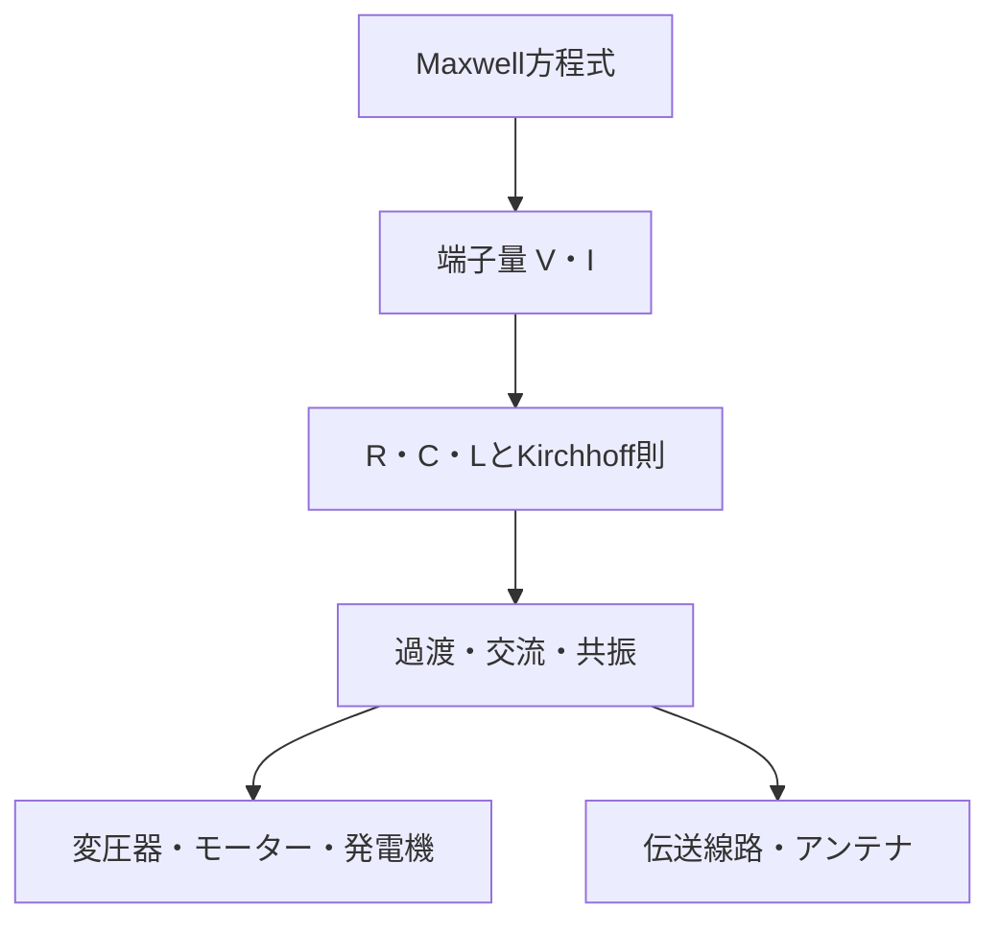

# 電磁気学から電気工学への応用マップ

## 理論から装置まで

| 理論 | 端子モデル | 装置・工学 |
|---|---|---|
| 局所Ohm則 | 抵抗 | 配線、ヒータ、センサー |
| Gauss則・誘電体 | 容量 | 平滑、蓄電、変位検出 |
| Faraday則・磁束 | 自己・相互L | コイル、変圧器、発電機 |
| Lorentz力 | トルク定数 | モーター |
| Poynting定理 | 端子電力 | 電力変換・送電・放射 |
| 波動解・境界条件 | 特性インピーダンス | ケーブル、基板配線、導波路 |
| 双極子放射 | 放射抵抗 | アンテナ |

## 次にどこへ進むか

- 回路網を詳しく解く： [10_circuits](../../10_circuits/00_overview.md)
- 場の理論を深める：境界値問題、導波路、数値電磁界解析。
- 電力を深める：三相交流、電力変換器、電気機器。
- 高周波を深める：Sパラメータ、整合回路、マイクロ波工学。

電磁気学章は「由来と近似」を正本とし、10_circuitsは解析手法・能動素子・実装・計測を詳しくする。Thévenin、Norton、二端子対、フィルタ、オペアンプ、ダイオード、トランジスタは後者で扱う。

## 演習と解答

1. 温度センサーの抵抗変化を電圧へ変える最小回路を選べ。
   **解答**：分圧回路。入力抵抗と自己発熱を確認する。
2. スイッチング電源の急峻な波形で必要なモデルを挙げよ。
   **解答**：寄生L・C、伝送線路、放射・EMI。基本周波数だけで判断しない。
3. 送電電圧を上げる理由を式で説明せよ。
   **解答**：同じ有効電力なら電流を下げられ、線路損失が電流の二乗で減る。
4. モーターと発電機の共通原理を述べよ。
   **解答**：Lorentz力によるトルクとFaraday誘導による起電力の相互変換。
5. アンテナの放射抵抗と材料抵抗の違いを述べよ。
   **解答**：前者は空間へ出る電力の端子等価、後者はJoule熱である。
6. 回路シミュレータから全波解析へ移る判断を述べよ。
   **解答**：寸法対波長、遅延対立上り、放射、反射、モード、要求精度を比較する。

## ナビゲーション

- 前：[大学受験回路の解法戦略](04_high_school_circuit_problem_strategy.md)
- 親：[Q&A入口](README.md)
- 工学体系：[10_circuits](../../10_circuits/00_overview.md)
