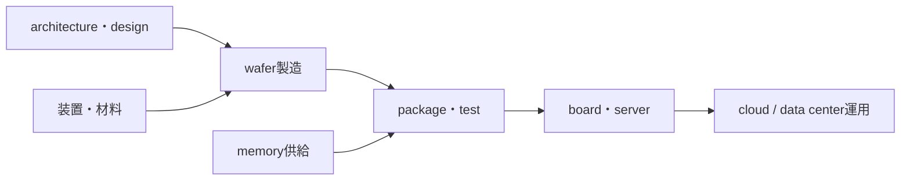

# 半導体企業をvalue chainへ配置する

## 配置問題

企業はfabless、foundry、integrated device manufacturer、memory supplier、OSAT/package、equipment、material、system/cloudなど複数の役割を持ち得ます。会社名だけで一層へ固定せず、対象製品ごとに見ます。

## 演習と全解答

1. NVIDIA GPUとMicron HBMを配置せよ。  
   **解答**：前者はcompute architecture/chip/system設計、後者はmemory device・stack供給です。
2. キオクシアSSDはNAND cellだけか。  
   **解答**：違います。SSD製品ではcontroller、firmware、interface、packageも含みます。
3. SK hynixをHBMだけの企業と説明してよいか。  
   **解答**：不十分です。DRAM、NAND、SSDなども公式製品範囲です。
4. foundryとfablessの違いを述べよ。  
   **解答**：fablessは主にchip設計、foundryは顧客設計をwafer製造します。
5. package企業の価値を「箱詰め」以上に説明せよ。  
   **解答**：微細接続、signal/power integrity、熱、test、2.5D/3D統合を担います。
6. 企業の市場順位を本章の主題にしない理由を述べよ。  
   **解答**：物理から製品への接続が目的で、順位は時点・定義で変動するためです。
7. 供給関係を推測で埋めない方法を述べよ。  
   **解答**：当事者のpress release、product page、filingで製品・時点を確認し、不明は不明とします。
8. 一社が複数層を担当する例を述べよ。  
   **解答**：NVIDIAはGPUだけでなくNVLink、networking、DPU、HGX/DGX systemも扱います。

## ナビゲーション

- 前：[memory比較](07_memory_product_comparison.md)
- 本文：[企業マップ](../part07_semiconductor_products/12_company_map_kioxia_micron_skhynix_nvidia.md)
- 親：[Q&A入口](README.md)
