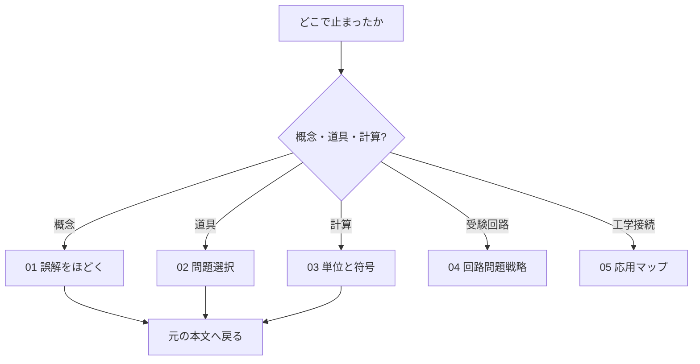

# 電磁気学Q&A――混同をほどき、解法へ戻る

> 章内位置：23 / 24
> 役割：本文を読み直す前に、混同した概念と選ぶべき道具を特定する

## このQ&Aの使い方

この区画は公式の短文集ではありません。「似た言葉の違い」「問題文から道具を選ぶ判断」「単位と符号の検算」を、それぞれ独立した復帰手順にします。

この図は、つまずきの種類から戻るページを選ぶための案内です。

## 記事一覧

1. [01_common_misconceptions.md](01_common_misconceptions.md)
   電位と電場、電束密度、電子速度、磁場の仕事、近傍場など14の混同を解消します。
2. [02_problem_selection.md](02_problem_selection.md)
   対称性、時間依存、媒質、境界、求める量から解法を選びます。
3. [03_units_and_signs.md](03_units_and_signs.md)
   SI単位、面・周回方向、右手則、Faraday則、境界条件の符号を点検します。
4. [04_high_school_circuit_problem_strategy.md](04_high_school_circuit_problem_strategy.md)
   大学受験の回路・コンデンサ・コイル問題で、使った近似と捨てた場の情報まで確認します。
5. [05_engineering_application_map.md](05_engineering_application_map.md)
   Maxwell方程式から電気機器・送電・高周波へ進む地図です。

## 30秒診断

- 「何が違うのか説明できない」なら01。
- 「何を使えばよいか分からない」なら02。
- 「式は立ったが答えの向きや単位が怪しい」なら03。
- 数学操作そのものが止まったなら[補習](../remedial/README.md)。

## 学習チェック

- つまずきを「概念」「解法選択」「計算検算」のいずれかへ分類できる。
- Q&Aだけで完結せず、対応する本文へ戻れる。

## ナビゲーション

- 前：[回路応用](../part05_circuit_applications/README.md)
- 次：[誤解をほどく](01_common_misconceptions.md)
- 親：[電磁気学の全体像](../00_overview.md)
- 補習：[remedial](../remedial/README.md)
