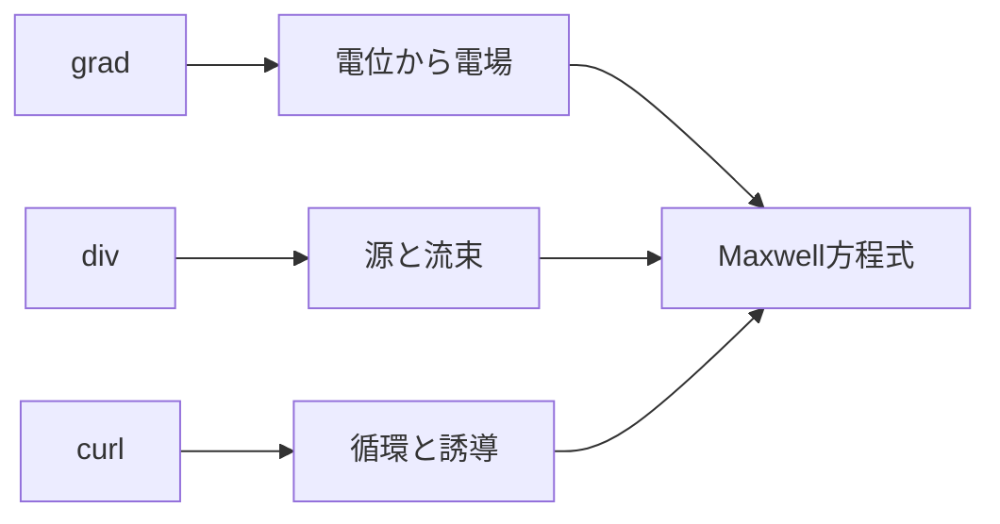

# 電磁気学へ戻るためのベクトル解析

> 一般論の正本：[vector_analysis](../../00_physics_math_tools/vector_analysis/README.md)
> このページの目的：Maxwell方程式での使用箇所だけを再接続する

## 1. 3演算の役割

スカラー場の勾配：

$$
\nabla\phi
$$

は最も急に増える向きと増加率です。静電場では

$$
\mathbf{E}=-\nabla\phi
$$

です。

ベクトル場の発散：

$$
\nabla\cdot\mathbf{F}
$$

は局所的な湧き出しです。

$$
\nabla\cdot\mathbf{D}=\rho_{\mathrm f}
$$

に現れます。

ベクトル場の回転：

$$
\nabla\times\mathbf{F}
$$

は局所的な循環です。

$$
\nabla\times\mathbf{E}=-\frac{\partial\mathbf{B}}{\partial t}
$$

に現れます。

## 2. 積分定理

Gaussの発散定理：

$$
\int_V\nabla\cdot\mathbf{F}\,dV=\oint_{\partial V}\mathbf{F}\cdot d\mathbf{S}
$$

内部の源の総量を境界から出る流束へ変換します。Gauss則の微分形と積分形を結びます。

Stokesの定理：

$$
\int_S
(\nabla\times\mathbf{F})\cdot d\mathbf{S}=\oint_{\partial S}\mathbf{F}\cdot d\mathbf{l}
$$

面内の渦の総量を境界の循環へ変換します。Faraday則とAmpère–Maxwell則の二つの形を結びます。

## 3. Laplacian

スカラー場では

$$
\nabla^2\phi=\nabla\cdot(\nabla\phi)
$$

です。静電場で

$$
\mathbf{E}=-\nabla\phi
$$

をGauss則へ代入するとPoisson方程式が出ます。

$$
\nabla^2\phi=-\frac{\rho}{\varepsilon_0}
$$

ベクトル場では各成分へLaplacianを作用させます。

## 4. 最重要恒等式

$$
\nabla\times(\nabla\times\mathbf{F})=
\nabla(\nabla\cdot\mathbf{F})
-\nabla^2\mathbf{F}
$$

真空中で

$$
\nabla\cdot\mathbf{E}=0
$$

なら

$$
\nabla\times(\nabla\times\mathbf{E})=-\nabla^2\mathbf{E}
$$

となり、電磁波の波動方程式を作れます。

また

$$
\nabla\cdot(\nabla\times\mathbf{F})=0
$$

をAmpère–Maxwell則へ使うと電荷保存が得られます。

## 5. 短い計算例

場

$$
\mathbf{E}=ax\,\hat{\mathbf{x}}
$$

では

$$
\nabla\cdot\mathbf{E}=a
$$

なので、真空中なら対応する電荷密度は

$$
\rho=\varepsilon_0a
$$

です。

場

$$
\mathbf{E}=-\frac{r}{2}\frac{dB}{dt}\,\hat{\boldsymbol{\phi}}
$$

は円周に沿うため、線積分すると

$$
\oint_C\mathbf{E}\cdot d\mathbf{l}=-\pi r^2\frac{dB}{dt}
$$

となりFaraday則と一致します。

## 6. 誤りと復帰手順

- 発散と回転をどちらも「微分」とだけ覚えない。
- 面法線と周回方向を独立に選ばない。
- 二重回転を単純に

$$
\nabla^2\mathbf{F}
$$

としない。

復帰手順は、

1. 入力がスカラーかベクトルか確認。
2. 出力がスカラーかベクトルか予測。
3. 積分領域の次元を確認。
4. Maxwell方程式の対応行へ戻る。

です。

## 7. 演習問題

1. 電位

$$
\phi=ax^2
$$

から電場を求めよ。
2. 場

$$
\mathbf{F}=(x,y,z)
$$

の発散を求めよ。
3. 場

$$
\mathbf{F}=(-y,x,0)
$$

の回転を求めよ。
4. Gaussの定理が結ぶ二つの積分を書け。
5. Stokesの定理で面法線を反転したとき何が変わるか。
6. 二重回転恒等式から、発散ゼロの場の関係を導け。

## 8. 全解答

1.

$$
\mathbf{E}=-2ax\,\hat{\mathbf{x}}
$$

です。
2.

$$
\nabla\cdot\mathbf{F}=3
$$

です。
3.

$$
\nabla\times\mathbf{F}=2\hat{\mathbf{z}}
$$

です。
4. 体積内の発散の積分と、境界面を通る流束です。
5. 面積分の符号と、整合する境界周回方向の両方が反転します。
6.

$$
\nabla\cdot\mathbf{F}=0
$$

なら

$$
\nabla\times(\nabla\times\mathbf{F})=-\nabla^2\mathbf{F}
$$

です。

## ナビゲーション

- 前：[補習入口](README.md)
- 次：[ODE・PDE](02_ode_pde_refresh.md)
- 親：[電磁気学の全体像](../00_overview.md)
