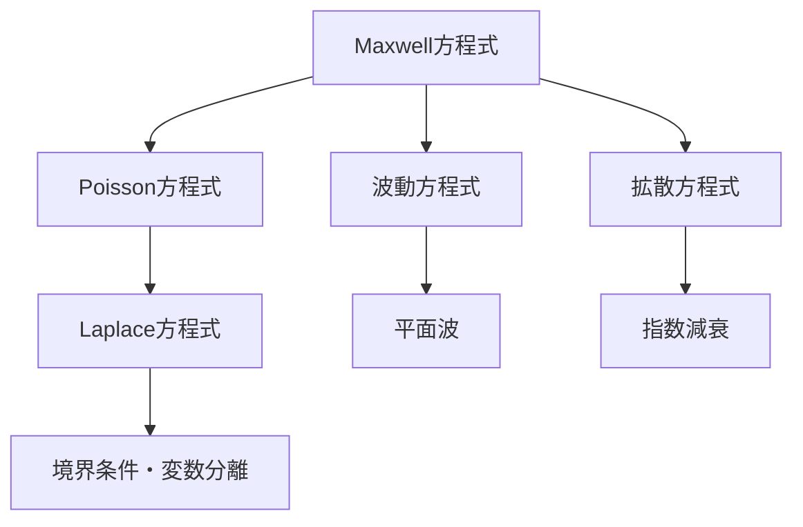

# 電磁気学へ戻るためのODE・PDE

> 一般的なODEの正本：[differential_equations](../../00_physics_math_tools/differential_equations/README.md)
> このページの目的：静電境界値問題、波動、導体内拡散へ復帰する

## 1. 方程式の地図

電荷がある静電場：

$$
\nabla^2\phi=-\frac{\rho}{\varepsilon_0}
$$

電荷がない静電領域：

$$
\nabla^2\phi=0
$$

真空中の電磁波：

$$
\nabla^2\mathbf{E}
-\frac{1}{c^2}
\frac{\partial^2\mathbf{E}}{\partial t^2}=0
$$

良導体内の低周波近似：

$$
\nabla^2\mathbf{E}
-\mu\sigma\frac{\partial\mathbf{E}}{\partial t}
\simeq0
$$

です。

## 2. 初期条件と境界条件

時間発展問題では初期時刻の場と時間微分を指定します。空間境界値問題では、境界上の値または法線微分を指定します。

- Dirichlet条件：場または電位の値
- Neumann条件：法線微分または流束
- Robin条件：値と微分の線形結合

条件を多く与えすぎても少なすぎても解は一意に決まりません。電磁気では境界条件がMaxwell方程式から供給されます。

## 3. 変数分離

二次元Laplace方程式

$$
\frac{\partial^2\phi}{\partial x^2}
+\frac{\partial^2\phi}{\partial y^2}=0
$$

で

$$
\phi(x,y)=X(x)Y(y)
$$

と置くと

$$
\frac{X''}{X}=-\frac{Y''}{Y}=-k^2
$$

と分離できます。

$$
X''+k^2X=0
$$

$$
Y''-k^2Y=0
$$

を解き、境界条件で許される波数と係数を決めます。

## 4. 平面波解

時間規約を

$$
e^{-i\omega t}
$$

とし、

$$
\mathbf{E}=\mathbf{E}_0e^{i\mathbf{k}\cdot\mathbf{r}}
e^{-i\omega t}
$$

を波動方程式へ代入すると

$$
\nabla^2\to-k^2
$$

$$
\frac{\partial^2}{\partial t^2}\to-\omega^2
$$

なので

$$
k^2=\frac{\omega^2}{c^2}
$$

です。

## 5. 波動と拡散の違い

波動方程式は二階時間微分を持ち、位相を保ちながら両方向へ伝搬できます。拡散方程式は一階時間微分を持ち、細かな空間変化を時間とともにならします。

導体中では両方が共存します。

$$
\nabla^2\mathbf{E}=\mu\sigma\frac{\partial\mathbf{E}}{\partial t}
+\mu\varepsilon\frac{\partial^2\mathbf{E}}{\partial t^2}
$$

項の大小を比較してから近似します。

## 6. 検算と復帰手順

- 微分階数に必要な条件数が対応するか。
- 指数の引数が無次元か。
- 境界条件を代入して満たすか。
- 静的極限でPoisson・Laplaceへ戻るか。

復帰手順：

1. 未知関数と独立変数を書く。
2. 線形・一様係数か確認。
3. 初期値問題か境界値問題か分類。
4. 座標系と対称性を選ぶ。
5. 解を代入してから物理解釈する。

## 7. 演習問題

1. 一次元Laplace方程式の一般解を求めよ。
2. 一次元Poisson方程式

$$
\phi''=-\rho_0/\varepsilon_0
$$

の一般解を求めよ。
3. 平面波代入から真空の分散関係を導け。
4. 波動方程式と拡散方程式の時間微分階数を比較せよ。
5. Dirichlet条件とNeumann条件の違いを述べよ。
6. 変数分離で分離定数を導入する理由を述べよ。

## 8. 全解答

1.

$$
\phi(x)=Ax+B
$$

です。
2.

$$
\phi(x)=-\frac{\rho_0}{2\varepsilon_0}x^2+Ax+B
$$

です。
3.

$$
k^2=\omega^2/c^2
$$

です。
4. 波動方程式は二階、拡散方程式は一階です。
5. 前者は境界上の値、後者は法線方向微分または流束を指定します。
6. 左辺が一方の変数だけ、右辺が他方だけの関数なので、全点で等しいには定数でなければならないからです。

## ナビゲーション

- 前：[ベクトル解析](01_vector_calc_for_em.md)
- 次：[交流の複素表示](03_complex_representation_ac.md)
- 親：[補習入口](README.md)
