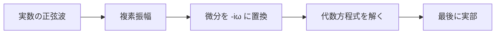

# 交流・損失媒質へ戻るための複素表示

> 章内統一規約：
>
> $$
> e^{-i\omega t}
> $$
>
> 物理量は最後に実部を取る

## 1. 複素振幅は計算道具

実際の電場

$$
\mathbf{E}(t)=E_0\cos(\omega t-\phi)\,\hat{\mathbf{x}}
$$

を

$$
\mathbf{E}(t)=\Re\left[
\tilde{\mathbf{E}}e^{-i\omega t}
\right]
$$

$$
\tilde{\mathbf{E}}=E_0e^{i\phi}\hat{\mathbf{x}}
$$

と表します。複素数そのものを測定するのではなく、振幅と位相を一つの数に保存し、微分方程式を代数方程式へ変える道具です。

## 2. 位相差

二つの複素振幅

$$
\tilde V=V_0e^{i\phi_V}
$$

$$
\tilde I=I_0e^{i\phi_I}
$$

の位相差は

$$
\phi_V-\phi_I
$$

です。共通の時間因子は省略できますが、規約は省略してはいけません。

## 3. インピーダンス

抵抗：

$$
\tilde V=R\tilde I
$$

コイルでは

$$
V=L\frac{dI}{dt}
$$

より

$$
\tilde V=-i\omega L\tilde I
$$

したがって

$$
Z_L=-i\omega L
$$

です。

コンデンサでは

$$
I=C\frac{dV}{dt}
$$

より

$$
\tilde I=-i\omega C\tilde V
$$

$$
Z_C=\frac{\tilde V}{\tilde I}=\frac{1}{-i\omega C}=\frac{i}{\omega C}
$$

です。教科書でよく見る逆符号は

$$
e^{+i\omega t}
$$

規約によるものです。

## 4. 複素誘電率

Ampère–Maxwell則で

$$
\mathbf{J}_{\mathrm c}
+\frac{\partial\mathbf{D}}{\partial t}=\sigma\mathbf{E}
-i\omega\varepsilon\mathbf{E}
$$

です。これを

$$
-i\omega\tilde\varepsilon\mathbf{E}
$$

とまとめると

$$
\boxed{
\tilde\varepsilon=\varepsilon+\frac{i\sigma}{\omega}
}
$$

です。この虚部符号も時間規約に依存します。損失を含むより一般の媒質では、分極の遅れも複素誘電率へ含めます。

## 5. 複素波数

平面波

$$
\mathbf{E}=\Re\left[
\mathbf{E}_0e^{ikz}e^{-i\omega t}
\right]
$$

で

$$
k=\beta+i\alpha
$$

なら

$$
e^{ikz}=e^{i\beta z}e^{-\alpha z}
$$

です。

$$
\alpha>0
$$

が減衰定数、

$$
\beta
$$

が位相定数です。導体では

$$
k^2=\mu\varepsilon\omega^2+i\mu\sigma\omega
$$

となります。

## 6. 時間平均

二つの実数調和量

$$
\mathbf{A}(t)=\Re[\tilde{\mathbf A}e^{-i\omega t}]
$$

$$
\mathbf{B}(t)=\Re[\tilde{\mathbf B}e^{-i\omega t}]
$$

について

$$
\left\langle
\mathbf A(t)\cdot\mathbf B(t)
\right\rangle=\frac{1}{2}
\Re\left(
\tilde{\mathbf A}\cdot\tilde{\mathbf B}^*
\right)
$$

です。平均Poyntingベクトルは

$$
\langle\mathbf S\rangle=\frac{1}{2}
\Re\left(
\tilde{\mathbf E}\times\tilde{\mathbf H}^*
\right)
$$

です。

## 7. 誤解・復帰手順

- 複素振幅へ時間因子を二重に含めない。
- 規約の異なる式を符号だけ比較しない。
- 位相定数と減衰定数を取り違えない。
- 実部を取る前の複素場を直接測定量と呼ばない。

復帰手順：

1. 時間規約を書く。
2. 複素振幅と実場を分離する。
3. 微分を

$$
-i\omega
$$

へ置換する。
4. 解の指数が進行・減衰する向きを確認する。
5. 実部または時間平均を取る。

## 8. 演習問題

1. 実場

$$
E_0\cos(\omega t-\phi)
$$

の複素振幅を章内規約で書け。
2. 時間微分の置換を書け。
3. コイルのインピーダンスを導け。
4. コンデンサのインピーダンスを導け。
5. 伝導電流を含む複素誘電率を導け。
6. 複素波数の虚部が正なら、正のz方向で何が起きるか。
7. 平均Poyntingベクトルを書け。

## 9. 全解答

1.

$$
\tilde E=E_0e^{i\phi}
$$

です。
2.

$$
\partial_t\to-i\omega
$$

です。
3.

$$
Z_L=-i\omega L
$$

です。
4.

$$
Z_C=\frac{i}{\omega C}
$$

です。
5.

$$
\tilde\varepsilon=\varepsilon+\frac{i\sigma}{\omega}
$$

です。
6.

$$
e^{-\operatorname{Im}(k)z}
$$

で振幅が減衰します。
7.

$$
\langle\mathbf S\rangle=\frac{1}{2}
\Re\left(
\tilde{\mathbf E}\times\tilde{\mathbf H}^*
\right)
$$

です。

## ナビゲーション

- 前：[ODE・PDE](02_ode_pde_refresh.md)
- 次：[章の全体像](../00_overview.md)
- 親：[補習入口](README.md)
- 応用：[導体と表皮効果](../part03_phenomenology/02_conductors_and_skin_effect.md)
