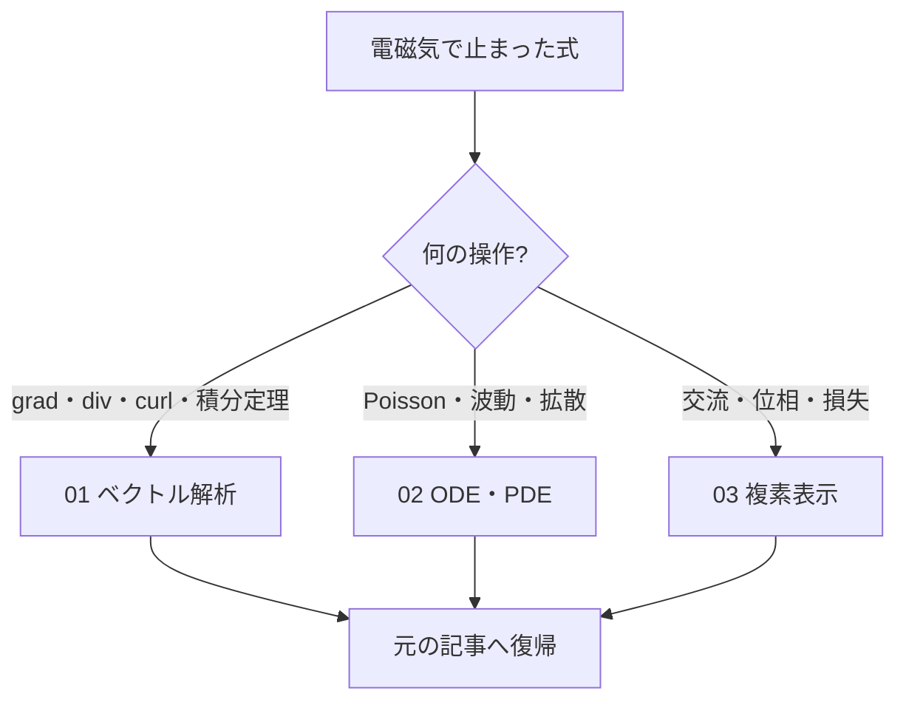

# 電磁気学の補習室――必要な数学だけへ戻る

> 章内位置：15 / 15「必要な数学への復帰」
> 役割：数学を一般論から学び直さず、止まった電磁気の式へ最短で復帰する

## どこへ戻るか

## 記事一覧

1. [01_vector_calc_for_em.md](01_vector_calc_for_em.md)
   grad・div・curl、Gauss・Stokes、Laplacian、二重回転をMaxwell方程式の使用箇所へ結びます。
2. [02_ode_pde_refresh.md](02_ode_pde_refresh.md)
   Poisson・Laplace・波動・拡散方程式、境界条件、変数分離、平面波を復習します。
3. [03_complex_representation_ac.md](03_complex_representation_ac.md)
   複素振幅、位相、インピーダンス、複素誘電率・波数を章内規約で統一します。

一般的な詳説は、正本である[物理数学ツール](../../00_physics_math_tools/00_overview.md)を参照してください。この補習では同じ内容を重複コピーしません。

## 復帰の完了条件

- 数学記号を日本語で説明できる。
- Maxwell方程式のどこで使うか指差せる。
- 一つの短い計算を自力で再現できる。
- 元の記事へ戻り、止まった行の次へ進める。

## ナビゲーション

- 前：[単位と符号](../qa/03_units_and_signs.md)
- 次：[ベクトル解析補習](01_vector_calc_for_em.md)
- 親：[電磁気学の全体像](../00_overview.md)
