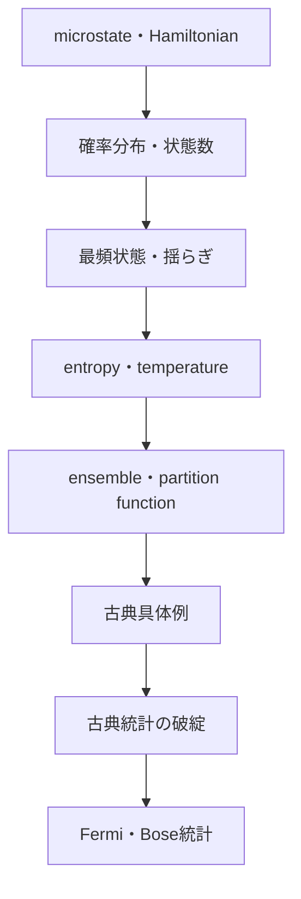

# 05 統計力学：知らない微視状態から、確かな巨視法則へ

## 章を貫く問い

微視的状態をすべて知らないのに、なぜ温度・圧力・entropyを高精度で予測できるのでしょうか。統計力学は、力学的状態、確率、数え上げ、熱力学への翻訳、量子統計という異なる難しさを接続する理論です。

## 前章から受け取るもの

- 解析力学：Hamiltonian、phase space、保存量
- 熱力学：温度、entropy、free energy、chemical potential、平衡条件
- 確率・組合せ：分布、期待値、分散、大数、状態数

## 難しさの5層

| 層 | 問い | 止まったとき |
|---|---|---|
| 1 力学 | microstateを何で指定するか | Hamiltonian・phase spaceへ戻る |
| 2 確率 | 分布・期待値・揺らぎをどう読むか | [補習診断](remedial/README.md) |
| 3 数え上げ | multiplicityをどう数えるか | coin・二準位・Einstein solid |
| 4 翻訳 | entropy・温度・free energyへどう結ぶか | ensembleとpartition function |
| 5 量子統計 | 同種粒子をどう占有させるか | Fermi・Boseと量子力学の役割分担 |

## 残す情報・省略する情報

各粒子の可能な状態とHamiltonianは残しますが、実際のmicrostateを一点として知る要求を捨て、分布と期待値で記述します。熱力学より微視的ですが、完全な軌道計算より粗視化されています。

## 本線

1. [気体分子運動論](part01_kinetic_theory/01_kinetic_theory_pressure_temperature.md)
2. [microstate・macrostateと小さな数え上げ](part01_kinetic_theory/02_microstate_macrostate_small_counting.md)
3. [multiplicity・最頻状態・揺らぎ](part01_kinetic_theory/03_multiplicity_fluctuations_einstein_solid.md)
4. [microcanonical ensembleとBoltzmann entropy](part02_classical_ensembles/01_microcanonical_entropy_temperature.md)
5. [canonical ensemble・Boltzmann因子・partition function](part02_classical_ensembles/02_canonical_boltzmann_partition.md)
6. [grand canonical ensemble・chemical potential](part02_classical_ensembles/03_grand_canonical_and_chemical_potential.md)
7. [古典具体例と等分配](part02_classical_ensembles/04_classical_examples_and_equipartition.md)
8. [古典統計の限界とFermi・Bose](part03_quantum_and_applications/01_classical_limit_fermi_bose.md)
9. [半導体carrier・状態密度・Fermi準位](part03_quantum_and_applications/02_semiconductor_carriers_and_einstein_relation.md)
10. [相転移・情報・材料・生物・宇宙・計算](part03_quantum_and_applications/03_modern_applications_map.md)

## 熱力学との境界

熱力学は微視構造を仮定せず、状態量の関係、可能・不可能な過程、平衡、最大効率、収支を扱います。統計力学は微視モデルと確率から温度・圧力・entropyの意味、比熱、揺らぎ、相転移、物質差、Fermi準位を説明します。どちらも独立した役割があります。

## 量子力学との境界

- 量子力学：量子状態と時間発展。
- 統計力学：多数自由度の確率的記述。
- 量子統計力学：量子状態を多数粒子統計で扱う。

希薄気体、高温極限、古典粒子、古典分子動力学では古典統計が有効です。電子・光子・phonon、低温比熱、黒体、半導体carrier、金属電子、Bose凝縮では量子統計が必要です。バンド構造とトンネルの導出は[量子力学](../07_quantum_mechanics/00_overview.md)へ残します。

## 半導体から回収する問い

[半導体bridge](../02_electromagnetism/part06_semiconductor_bridge/README.md)で保留したFermi準位、Fermi–Dirac分布、状態密度、電子・正孔密度、Boltzmann近似、温度依存、chemical potential、Einstein関係の統計的背景を正式に扱います。

## 読者別ルート

- 初学者：1→2→3→4→5。
- 熱力学から：4→5→6→7。
- 半導体：5→6→8→9。
- ML・計算：2→5→10。
- 量子・物性：5→8→9→量子力学。

## 適用範囲と次の限界

平衡統計を中心にし、ergodicityと熱力学極限を吟味します。強い非平衡、glass、有限時間の輸送は追加理論が必要です。量子状態そのもの、band、spin dynamics、tunnelingは量子力学へ進みます。

## 完成状態

古典統計から量子統計・半導体・現代応用まで10記事、補習診断、固有演習と全解答を本文化済みです。

## ナビゲーション

- 前：[熱力学](../04_thermodynamics/00_overview.md)
- 次：[相対論](../06_relativity/00_overview.md)／[量子力学](../07_quantum_mechanics/00_overview.md)
- 親：[Physics Tower](../README.md)
