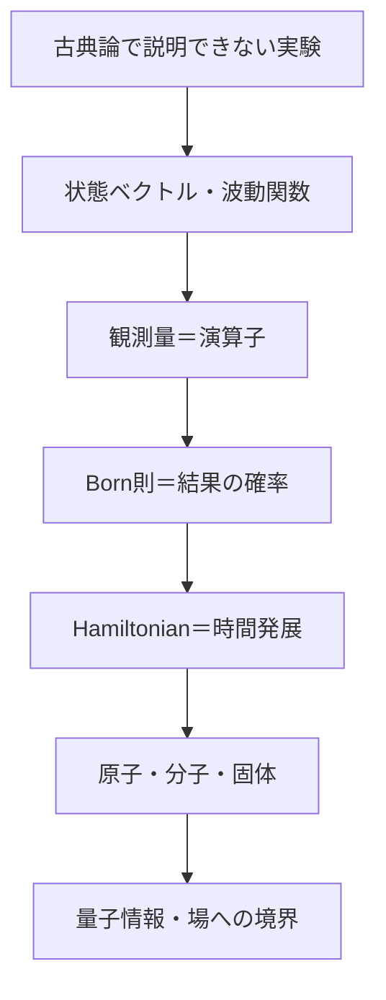
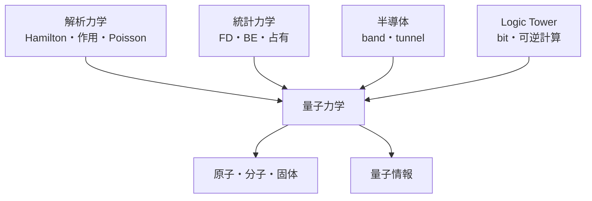

# 07 量子力学――古典的な「状態」を作り直す

## 章を貫く問い

粒子が常に位置と速度を持ち、測定はその値を読み取るだけだという古典的モデルが破綻したとき、何を「状態」とし、何を予測できるのでしょうか。

量子力学は古典力学を単に否定する理論ではありません。作用が

$$
S\gg\hbar
$$

で、干渉位相が実験分解能や環境相互作用で平均化される領域では、古典力学は極めて正確な有効理論です。本章は「いつ古典像が失敗し、どの情報表現へ交換するか」を追います。

## 古典物理から受け取るもの／更新するもの

| 観点 | 古典物理から残す | 量子力学で更新する |
|---|---|---|
| 状態 | 系・自由度・初期条件 | 位相を含む状態ベクトル。位置表示は波動関数 |
| 力学 | Hamiltonian、作用、対称性 | Hamiltonianが状態のunitary時間発展を生成 |
| 観測量 | 位置、運動量、角運動量、energy | Hermitian演算子と測定結果の確率分布 |
| 確率 | 無知やensembleの分布 | 振幅を足してから絶対値二乗を取る |
| 保存則 | 時間・空間対称性 | Hamiltonianとの可換性、量子数、選択則 |
| 近似 | 対象とscaleを選ぶ | 非相対論、一粒子、固定核、独立粒子などを明示 |

波動関数

$$
\psi(\mathbf r,t)=\langle\mathbf r|\psi(t)\rangle
$$

は一粒子の位置表示です。一般状態そのものを物理空間に塗られた物質密度と同一視しません。spinは二成分、複数粒子はconfiguration space、mixed stateはdensity operatorで表します。

## 記号・規約

| 対象 | 規約 |
|---|---|
| ket・bra | $$|\psi\rangle,\quad\langle\psi|$$ |
| 内積・規格化 | $$\langle\phi|\psi\rangle,\quad\langle\psi|\psi\rangle=1$$ |
| 波動関数 | $$\psi(\mathbf r,t),\quad\psi^*(\mathbf r,t)$$ |
| 演算子・期待値 | $$\hat A,\quad\langle\hat A\rangle=\langle\psi|\hat A|\psi\rangle$$ |
| 分散 | $$(\Delta A)^2=\langle\hat A^2\rangle-\langle\hat A\rangle^2$$ |
| commutator | $$[\hat A,\hat B]=\hat A\hat B-\hat B\hat A$$ |
| 時間発展 | $$i\hbar\frac{\partial}{\partial t}|\psi\rangle=\hat H|\psi\rangle$$ |
| Fourier変換 | $$\phi(\mathbf p)=\frac{1}{(2\pi\hbar)^{3/2}}\int e^{-i\mathbf p\cdot\mathbf r/\hbar}\psi(\mathbf r)\,d^3r$$ |

定数は

$$
h=6.62607015\times10^{-34}\ \mathrm{J\,s},\qquad
\hbar=\frac{h}{2\pi}
$$

$$
m_e=9.1093837\times10^{-31}\ \mathrm{kg},\quad
e=1.602176634\times10^{-19}\ \mathrm C
$$

$$
k_{\mathrm B}=1.380649\times10^{-23}\ \mathrm{J/K},\quad
c=2.99792458\times10^8\ \mathrm{m/s}
$$

を用います。

$$
1\ \mathrm{eV}=1.602176634\times10^{-19}\ \mathrm J
$$

は原子・固体のenergy scaleに使い、SIへ換算可能な形を保ちます。

## 本線のストーリー

1. [古典像が破綻する実験](part01_mysteries/README.md)
2. [状態・Born則・演算子・測定](part02_matrix_formalism/README.md)
3. [Schrödinger方程式と基本問題](part09_schrodinger_dynamics/README.md)
4. [解析力学・行列表現からの接続](part06_via_analytical_mech/README.md)
5. [角運動量とspin](part03_angular_momentum_spin/README.md)
6. [原子・分子・量子化学](part08_quantum_chemistry/README.md)
7. [固体・半導体](part10_solid_state_semiconductors/README.md)
8. [同種粒子・多体系](part05_many_body/README.md)
9. [量子計算・量子情報](part07_quantum_computing/README.md)
10. [相対論的量子論と場への境界](part04_relativistic_qm/README.md)

## 伏線から入るルート

- 解析力学：Hamiltonian→時間発展、Poisson括弧→commutator、作用→経路積分の入口。
- 統計力学：量子状態の構造は本章、熱平衡での占有分布は[統計力学](../05_statistical_mechanics/part03_quantum_and_applications/01_classical_limit_fermi_bose.md)を正本とします。
- 半導体：[半導体bridge](../02_electromagnetism/part06_semiconductor_bridge/README.md)のband、有効質量、tunnel、量子閉じ込めを回収します。
- 量子計算：物理的状態・unitary・測定を本章、Boolean回路・可逆計算・論理の意味は[Logic Tower](../../logic_tower/90_essays/quantum_computing_and_logic/README.md)を正本とします。
- 量子化学：水素原子→分子軌道→Born–Oppenheimer→近似法の順に進みます。

数学で止まったら[診断補習](remedial_room/README.md)から、止まった式に対応する道具だけ復習します。

## 適用範囲と保留

本章の中心は低速・弱重力・固定粒子数を主とする非相対論的量子力学です。

- 特殊相対論の時空構造と導出は[06_relativity](../06_relativity/00_overview.md)へ保留します。
- 粒子の生成消滅、相対論的因果律、真空揺らぎ、光子を含む完全な相互作用は場の量子論が必要です。
- 多体系の厳密解、超伝導、量子Hall効果、量子場の繰り込みは入口までに留めます。
- decoherenceは干渉が局所的に観測しにくくなる機構を説明しますが、単独で解釈問題を一意に決着させません。

## 完成状態

歴史的実験から状態・測定・時間発展、代表potential、spin、原子・分子・solid、同種粒子、量子情報、相対論・場への境界までを本文化しました。固有演習・全解答と検査状態は[PROGRESS](../PROGRESS.md)を正本とします。

## ナビゲーション

- 親：[Physics Tower](../README.md)
- 前（番号順）：[相対論スケルトン](../06_relativity/00_overview.md)
- 最初：[古典像の破綻](part01_mysteries/README.md)
- 横断：[モデル交代](../cross_connections/README.md)
