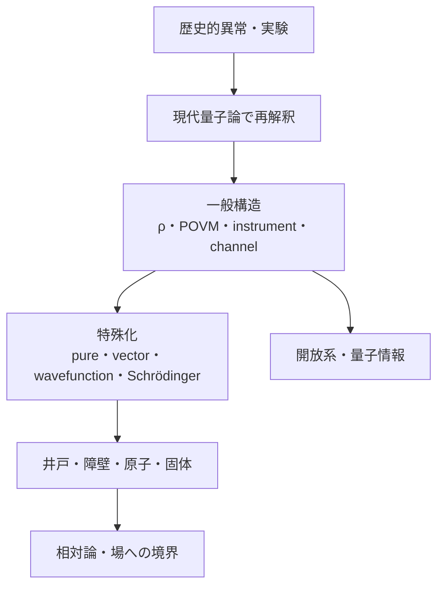
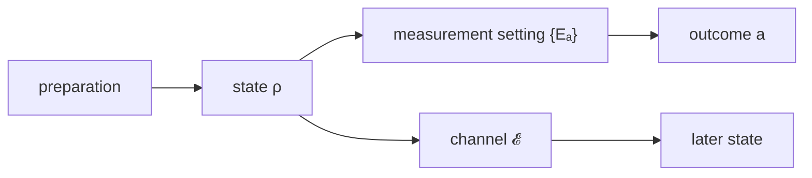

# 07 量子力学――歴史的異常から現代量子論、波動力学へ

## 章を貫く問い

粒子が常に位置と速度を持ち、測定はその値を読むだけだという古典modelが破綻したとき、何を状態として残し、どの実験の何を確率として予測するのでしょうか。

本章は二つの競合理論を並べません。最初にdensity operator・POVM・instrument・quantum channelという**一般構造**を学び、その後にpure state・state vector・wavefunction・Schrödinger equationという**重要な特殊化と表現**を学びます。

## 古典物理のどの前提が破綻したか

| 古典的な前提 | 実験が迫った更新 |
|---|---|
| energy交換は連続 | 黒体放射・光電効果・原子spectraで離散的交換 |
| 光は波、物質は粒子という排他的分類 | photon検出と一粒子干渉を同じ予測規則で扱う |
| 位置・運動量・spin成分は測定前から同時に値を持つ | 非可換測定、Stern–Gerlach、Bell相関 |
| 測定は既存値を受動的に読む | settingごとのoutcome probabilityとstate updateを分離 |
| 孤立系だけ見れば十分 | detector・environmentとの相互作用、decoherence、open system |

作用が

$$
S\gg\hbar
$$

で、位相差が分解能やenvironmentで平均化される領域では古典力学は高精度な有効理論です。量子論は「古典が全部誤り」ではなく、古典modelが成立する条件も説明対象にします。

## 歴史的発見と現代理論を分ける

Planck、Einstein、Bohr、de Broglieらが導入した歴史的modelと、後世のdensity operator・POVM・quantum channelによる説明を同一視しません。各歴史記事は、

1. 当時の問題
2. 歴史的に導入されたmodel
3. 現在の標準的理解
4. 現代量子情報・測定論からの再解釈
5. さらに量子統計・場が必要な部分

を区別します。

## 状態準備・状態・測定・時間発展

- **preparation**：再現可能な実験手順。
- **state**：将来の測定統計を予測するdensity operator。
- **measurement**：一般にはPOVMが結果確率を、instrumentが結果ごとのstate updateを定める。
- **change**：一般にはCPTP channel。閉鎖・可逆ならunitary。

一回のoutcomeはstateそのものではありません。同じstateかどうかは、許された測定に対して同じ確率を返すかで判定します。

## 一般状態とpure state

一般状態は

$$
\rho\geq0,\qquad\operatorname{Tr}\rho=1.
$$

rank-oneの場合だけ

$$
\rho=|\psi\rangle\langle\psi|
$$

と書け、pure state vectorが現れます。mixed stateは単なる「wavefunctionを知らない」場合に限らず、entangledな全体系から部分系を切り出したreduced stateにも現れます。

## 一般測定と射影測定

一般化Born則は

$$
p(a)=\operatorname{Tr}(\rho E_a),
\qquad E_a\geq0,\quad\sum_aE_a=I.
$$

POVMのうちorthogonal projectorからなるsharpな場合がPVMで、結果へ実数labelを付けるとself-adjoint observable

$$
A=\sum_aaP_a
$$

になります。POVMは確率を定めますが、一般にはpost-measurement stateを定めません。

## 一般の過程とunitary

一般のsystem単独の状態変化は

$$
\mathcal E(\rho)=\sum_kK_k\rho K_k^\dagger,
\qquad\sum_kK_k^\dagger K_k=I
$$

というCPTP mapです。閉鎖・可逆な場合は

$$
\rho\mapsto U\rho U^\dagger.
$$

さらに連続時間、pure stateへ限定すると

$$
i\hbar\partial_t|\psi\rangle=H|\psi\rangle
$$

が現れます。

## 波動関数とSchrödinger方程式の位置づけ

$$
\text{density operator}
\rightarrow\text{pure state}
\rightarrow\text{state vector}
\xrightarrow{\text{position basis}}\text{wavefunction}.
$$

すなわち

$$
\psi(\mathbf r,t)=\langle\mathbf r|\psi(t)\rangle
$$

はpure stateのposition representationです。spinor、多粒子configuration-space wavefunction、mixed stateのdensity kernelを区別します。

Schrödinger方程式は「量子状態のあらゆる変化」ではなく、孤立した閉鎖系に対する連続的で可逆なunitary発展です。open system、loss、dephasing、測定にはchannelやinstrumentが必要です。

## 三つの本線

### 第1の本線：歴史から一般構造へ

1. [歴史的実験](part01_mysteries/README.md)
2. [現代量子論の一般構造](part02_modern_formalism/README.md)
3. density operator
4. POVM
5. quantum instrument
6. quantum channel
7. unitary

### 第2の本線：一般構造から標準波動力学へ

1. [一般形式からwavefunctionへの橋](part02_modern_formalism/10_to_wavefunction_schrodinger.md)
2. [標準形式](part11_standard_formalism/README.md)
3. [Schrödinger dynamics](part09_schrodinger_dynamics/README.md)
4. [角運動量・spin](part03_angular_momentum_spin/README.md)
5. [原子・分子](part08_quantum_chemistry/README.md)
6. [固体・半導体](part10_solid_state_semiconductors/README.md)

### 第3の本線：合成系・量子情報・開放系へ

1. [合成系・partial trace](part02_modern_formalism/08_composite_entanglement.md)
2. [同種粒子・多体系](part05_many_body/README.md)
3. [量子計算・量子情報](part07_quantum_computing/README.md)
4. [decoherence・tomography](part02_modern_formalism/09_decoherence_tomography.md)
5. [相対論・場への境界](part04_relativistic_qm/README.md)

## 目的別ルート

- **歴史route**：黒体→光電→Compton→Bohr→電子回折→二重slit→Stern–Gerlach→Bell。
- **現代形式route**：準備→density operator→POVM→instrument→channel→unitary。
- **標準波動力学route**：pure→wavefunction→position/momentum→Schrödinger→井戸・障壁・振動子。
- **半導体route**：[band・有効質量・tunnel・閉じ込め](part10_solid_state_semiconductors/README.md)から電磁気・統計へ戻る。
- **量子情報route**：tensor product→entanglement→channel→noise→measurement→error correction。
- **数学補習route**：[診断室](remedial_room/README.md)で線形代数、Fourier、ODE、tensor productを必要箇所だけ戻る。

## 解析力学・統計力学・半導体の伏線

- [解析力学](../03_analytical_mechanics/00_overview.md)：Hamiltonian、作用、Poisson括弧、gaugeを受け取る。
- [統計力学](../05_statistical_mechanics/00_overview.md)：thermal state、Bose/Fermi占有、black-body mode占有を正本とする。
- [半導体bridge](../02_electromagnetism/part06_semiconductor_bridge/README.md)：band、tunnel、量子閉じ込めを本章で回収し、電位・電荷・電流は電磁気へ返す。
- [Logic Tower](../../logic_tower/90_essays/quantum_computing_and_logic/README.md)：Boolean回路・可逆計算との違いを正本とする。

## 記号・規約

| 対象 | 規約 |
|---|---|
| state vector | $$|\psi\rangle$$ |
| density operator | $$\rho$$ |
| effect・POVM | $$E_a,\ \{E_a\}_a$$ |
| projector・PVM | $$P_a,\ \{P_a\}_a$$ |
| instrument | $$\mathcal I_a$$ |
| Kraus operator | $$K_k,\ M_{a\mu}$$ |
| quantum channel | $$\mathcal E$$ |
| partial trace | $$\operatorname{Tr}_B$$ |
| unitary・Hamiltonian | $$U,\ H$$ |
| commutator | $$[A,B]=AB-BA$$ |
| wavefunction | $$\psi(\mathbf r)=\langle\mathbf r|\psi\rangle$$ |
| density kernel | $$\rho(\mathbf r,\mathbf r')$$ |
| probability current | $$\mathbf j=\frac{\hbar}{2mi}(\psi^*\nabla\psi-\psi\nabla\psi^*)$$ |

Fourier変換は

$$
\phi(\mathbf p)=\frac{1}{(2\pi\hbar)^{3/2}}
\int e^{-i\mathbf p\cdot\mathbf r/\hbar}
\psi(\mathbf r)\,d^3r
$$

に統一します。

## 解釈とdecoherence

操作的予測規則を本線とし、Copenhagen系、many-worlds、Bohm型、objective collapse、relational・information-based approachesは計算規則を学んだ後の支線に置きます。decoherenceはenvironmentとのentanglementによる局所干渉の抑制を説明しますが、単一結果の問題を必ず単独で解決するわけではありません。人間の意識は標準理論の必須要素ではありません。

## 相対論・場へ進む境界

本章の中心は低速・弱重力・固定粒子数を主とする非相対論的量子論です。

- 特殊相対論の時空構造は[06_relativity](../06_relativity/00_overview.md)を本文化後に再訪する。
- photonの生成消滅、spontaneous emission、相対論的因果律を完全に扱うにはquantized fieldが要る。
- 原子のenergy eigenvalueだけでは発光全過程を説明できず、atom・field・interaction・detectorが要る。

## 完成状態

PR #106の標準量子力学本文を維持しつつ、歴史を現代理論で読み直し、density operator・POVM・instrument・channelをwavefunctionより前へ移しました。記事単位のreview状態、演習数、出典確認は[PROGRESS](../PROGRESS.md)を正本とします。

## ナビゲーション

- 親：[Physics Tower](../README.md)
- 前（番号順）：[相対論スケルトン](../06_relativity/00_overview.md)
- 最初：[歴史的実験](part01_mysteries/README.md)
- 一般構造：[part02](part02_modern_formalism/README.md)
- 横断：[モデル交代](../cross_connections/README.md)
