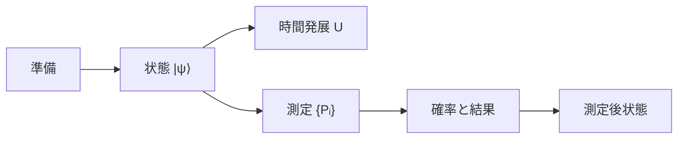

# part02 状態・波動関数・演算子

実験事実を、再現可能な予測規則へ圧縮します。

1. [状態・波動関数・Born則](01_state_wavefunction_born.md)
2. [重ね合わせ・相対位相・量子確率](02_superposition_phase_quantum_probability.md)
3. [Hilbert空間・演算子・固有値](03_hilbert_operators_eigenvalues.md)
4. [可換性・不確定性・Fourier表示](04_commutators_uncertainty_fourier.md)
5. [測定・状態更新・解釈](05_measurement_decoherence_interpretations.md)

位置波動関数は一般状態の一つの表示です。時間発展、測定確率、測定後状態、decoherence、解釈を別の問題として扱います。

- 前：[実験](../part01_mysteries/README.md)
- 次：[Schrödinger dynamics](../part09_schrodinger_dynamics/README.md)
- 親：[章overview](../00_overview.md)
