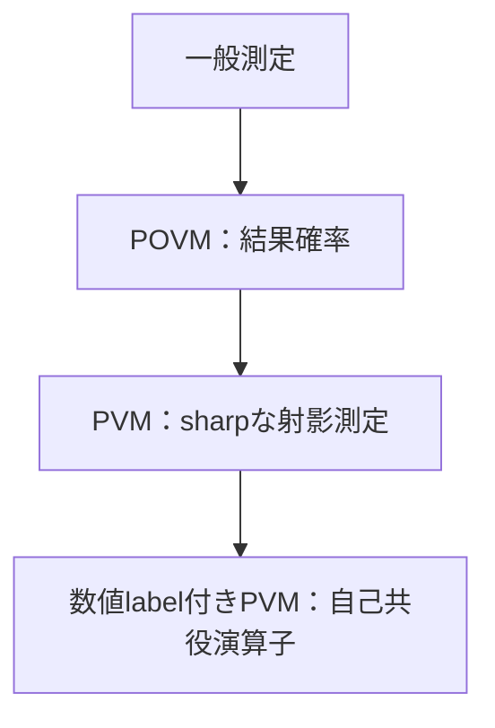

# PVM・物理量・自己共役演算子――一般測定の中のsharpな場合

## 包含関係

POVM

$$
\{E_a\}
$$

の各要素が直交projector

$$
P_aP_b=\delta_{ab}P_a,\qquad\sum_aP_a=I
$$

ならPVMです。有限次元で結果へ実数

$$
a
$$

を割り当てると

$$
A=\sum_a aP_a
$$

というself-adjoint operatorが得られます。逆にself-adjoint operatorのspectral decompositionはPVMを与えます。

## 期待値と分散

$$
\langle A\rangle=\operatorname{Tr}(\rho A)
=\sum_a a\,\operatorname{Tr}(\rho P_a),
$$

$$
(\Delta A)^2
=\operatorname{Tr}(\rho A^2)-\langle A\rangle^2.
$$

期待値は一回で得る値ではなく、同じ準備を反復した標本平均の理論値です。縮退があれば

$$
P_a
$$

は一次元とは限りません。

## observableとapparatusを分ける

自己共役演算子は、idealでsharpな測定の結果値と確率をまとめます。実装した装置の効率、noise、破壊的検出、測定後状態まで一つの演算子が完全に表すわけではありません。

## 演習と全解答

1.
   $$
   P_0=|0\rangle\langle0|,\quad P_1=|1\rangle\langle1|
   $$
   がPVMであることを確認せよ。
   **解答**：
   $$
   P_i^2=P_i,\quad P_0P_1=0,\quad P_0+P_1=I
   $$
2. 結果を
   $$
   \pm1
   $$
   とした演算子を書け。
   **解答**：
   $$
   Z=P_0-P_1
   $$
3.
   $$
   \rho=I/2
   $$
   でZの期待値と分散を求めよ。
   **解答**：
   $$
   \langle Z\rangle=0,\qquad
   (\Delta Z)^2=\operatorname{Tr}(\rho I)=1
   $$
4.
   $$
   E=\operatorname{diag}(0.8,0.2)
   $$
   がprojectorでないことを示せ。
   **解答**：
   $$
   E^2=\operatorname{diag}(0.64,0.04)\ne E
   $$
5. 同じPVMに結果labelを0,1と付ける場合と−1,+1と付ける場合で何が変わるか。
   **解答**：outcome probabilityは同じで、演算子の数値的期待値と分散が変わります。
6. 「すべての測定はHermitian演算子」と言い切れない理由を述べよ。
   **解答**：一般のnoisy・unsharp測定はPOVMを要し、さらにpost-measurement stateにはinstrumentが必要だからです。

## 参考・ナビゲーション

- 参考：[物理量が演算子であるとはどういうことか？（qm大学物理）](https://qmcharge.com/article-measurement-of-physical-quantities)（確認日：2026-07-27。POVMからsharp測定・PVMへ進む順序を検討）
- 前：[POVM](04_generalized_born_povm.md)
- 次：[instrument](06_instruments_state_update.md)
