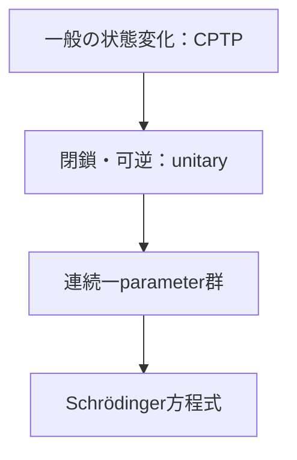

# 量子channel・unitary発展――一般変化と閉鎖系

## 一般の状態変化

量子systemだけに注目した決定論的変化は、完全正値・trace保存なmap

$$
\mathcal E
$$

すなわちCPTP mapで表します。有限次元では

$$
\mathcal E(\rho)=\sum_kK_k\rho K_k^\dagger,
\qquad
\sum_kK_k^\dagger K_k=I
$$

というKraus representationを持ちます。

完全正値性は、対象systemへ任意のancillaを付けても

$$
(\mathcal E\otimes\mathcal I)(\rho_{SA})\geq0
$$

が保たれることを要求します。

## environmentとの相互作用

初期environment state

$$
|e_0\rangle
$$

を付け、全体をunitary

$$
U_{SE}
$$

で発展させ、environmentを捨てると

$$
\mathcal E(\rho_S)
=\operatorname{Tr}_E[
U_{SE}(\rho_S\otimes|e_0\rangle\langle e_0|)
U_{SE}^\dagger]
$$

です。これはStinespring dilationの有限次元での見取り図です。

## unitaryは特殊例

閉鎖系の可逆変化は

$$
\rho\mapsto U\rho U^\dagger,
\qquad U^\dagger U=I
$$

です。連続時間で

$$
U(t+s)=U(t)U(s)
$$

を満たすと、適切な条件の下でself-adjoint generator

$$
H
$$

により

$$
U(t)=e^{-iHt/\hbar}
$$

と書けます。pure stateへ限定すれば

$$
i\hbar\frac{d}{dt}|\psi(t)\rangle
=H|\psi(t)\rangle
$$

です。

## 再構成の注意

可逆性からunitaryを理解する議論には、状態空間・確率保存・複素Hilbert構造などの前提があります。経験事実だけからunitaryが唯一必然的に出る、という主張ではありません。

## 演習と全解答

1. unitary channelのKraus operatorを書け。  
   **解答**：一個の
   $$
   K_1=U
   $$
   で、
   $$
   U^\dagger U=I
   $$
   です。
2. phase-flip channel
   $$
   \mathcal E(\rho)=(1-p)\rho+pZ\rho Z
   $$
   のKraus operatorを挙げよ。  
   **解答**：
   $$
   K_0=\sqrt{1-p}\,I,\quad K_1=\sqrt p\,Z
   $$
3. trace保存を確認せよ。  
   **解答**：
   $$
   K_0^\dagger K_0+K_1^\dagger K_1
   =(1-p)I+pI=I
   $$
4. 完全dephasing
   $$
   \rho\mapsto P_0\rho P_0+P_1\rho P_1
   $$
   が一般に可逆でない理由を述べよ。  
   **解答**：off-diagonal成分を捨て、異なる入力が同じ出力へ写るためです。
5.
   $$
   U(t)=e^{-iHt/\hbar}
   $$
   からSchrödinger方程式を導け。  
   **解答**：
   $$
   \frac d{dt}|\psi(t)\rangle
   =-\frac i\hbar H|\psi(t)\rangle
   $$
   の両辺へ
   $$
   i\hbar
   $$
   を掛けます。
6. open systemのsystem単独発展がunitaryでない例を挙げよ。  
   **解答**：environmentへwhich-path情報が漏れるdephasingではsystemのpurityが低下し、unitaryだけでは起こりません。

## 参考・ナビゲーション

- 参考：[ユニタリー時間発展とは？（qm大学物理）](https://qmcharge.com/article-double-ket-cptp-stinespring)（確認日：2026-07-27。CPTP・dilation・unitaryの包含関係を検討）
- 前：[instrument](06_instruments_state_update.md)
- 次：[合成系](08_composite_entanglement.md)

