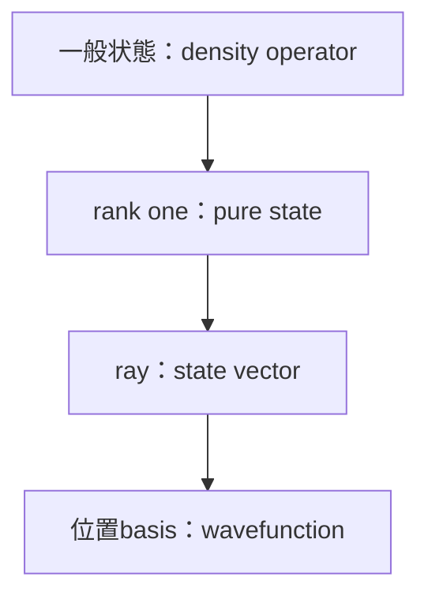

# 一般状態から波動関数・Schrödinger方程式へ

## 三段階の特殊化

pure stateへ限定すると

$$
\rho=|\psi\rangle\langle\psi|.
$$

位置basisを選ぶと

$$
\psi(\mathbf r)=\langle\mathbf r|\psi\rangle
$$

です。従ってwavefunctionは一般の量子状態そのものではなく、pure state vectorのposition representationです。

spin 1/2なら

$$
\psi(\mathbf r)=
\begin{pmatrix}
\psi_\uparrow(\mathbf r)\\
\psi_\downarrow(\mathbf r)
\end{pmatrix},
$$

二粒子なら

$$
\psi(\mathbf r_1,\mathbf r_2)
$$

はconfiguration space上の関数です。mixed stateは一般に一つのwavefunctionではなく、位置basisでdensity kernel

$$
\rho(\mathbf r,\mathbf r')
=\langle\mathbf r|\rho|\mathbf r'\rangle
$$

を持ちます。

## 一般測定から位置測定へ

idealな位置PVM

$$
P(\Delta)=\int_\Delta|\mathbf r\rangle\langle\mathbf r|\,d^3r
$$

に一般化Born則を使うと

$$
p(\mathbf r\in\Delta)
=\operatorname{Tr}[\rho P(\Delta)]
$$

です。pure stateなら

$$
p(\mathbf r\in\Delta)
=\int_\Delta|\psi(\mathbf r)|^2d^3r.
$$

現実のdetectorは有限pixel・point spread・効率を持つため、有限分解能POVMとして扱う方が適切です。

## unitaryからSchrödinger方程式へ

閉鎖系の連続unitary

$$
U(t)=e^{-iHt/\hbar}
$$

をpure stateに作用させると

$$
i\hbar\partial_t|\psi(t)\rangle=H|\psi(t)\rangle.
$$

さらにposition representationを取れば

$$
i\hbar\frac{\partial\psi}{\partial t}
=\left[-\frac{\hbar^2}{2m}\nabla^2+V\right]\psi
$$

です。これは一般のopen-system evolutionではなく、孤立・可逆な系の重要な特殊化です。

## 対応表

| 現代量子論 | 標準量子力学での特殊化 |
|---|---|
| density operator | pure state projector |
| state vector | position basisのwavefunction |
| POVM | ideal projective measurement |
| quantum instrument | projection postulate |
| CPTP map | unitary evolution |
| open system | isolated Schrödinger dynamics |
| reduced state | 一つのsubsystem wavefunctionでは一般に表せない |
| tensor product | two-particle wavefunction |

## 演習と全解答

1.
   $$
   \rho^2=\rho,\quad\operatorname{Tr}\rho=1
   $$
   なら有限次元で何が言えるか。  
   **解答**：固有値は0か1でtraceが1なのでrank one、すなわちpure stateです。
2. wavefunctionからdensity kernelを書け。  
   **解答**：
   $$
   \rho(\mathbf r,\mathbf r')
   =\psi(\mathbf r)\psi^*(\mathbf r')
   $$
3. mixed stateが一つのwavefunctionで表せない理由を述べよ。  
   **解答**：一つのwavefunctionはrank-one projectorしか作れず、rank 2以上のdensity operatorを表せないためです。
4. position Born則をtrace式から導け。  
   **解答**：
   $$
   \operatorname{Tr}[\rho P(\Delta)]
   =\int_\Delta\langle\mathbf r|\rho|\mathbf r\rangle d^3r
   =\int_\Delta|\psi(\mathbf r)|^2d^3r
   $$
5. pixel
   $$
   \Delta_j
   $$
   ごとのideal有限分解能測定のeffectを書け。  
   **解答**：
   $$
   E_j=\int_{\Delta_j}|\mathbf r\rangle\langle\mathbf r|\,d^3r,
   \quad \sum_jE_j=I
   $$
   です。blurがあればより一般のPOVMになります。
6. Schrödinger方程式が一般channelの式でない理由を述べよ。  
   **解答**：Hamiltonianが生成する連続unitaryへ限定し、system–environment相関によるdephasing・loss・measurementをsystem単独では含まないためです。

## 参考・ナビゲーション

- 前：[decoherenceとtomography](09_decoherence_tomography.md)
- 次：[標準形式への橋](../part11_standard_formalism/README.md)
- 計算：[Schrödinger dynamics](../part09_schrodinger_dynamics/README.md)

