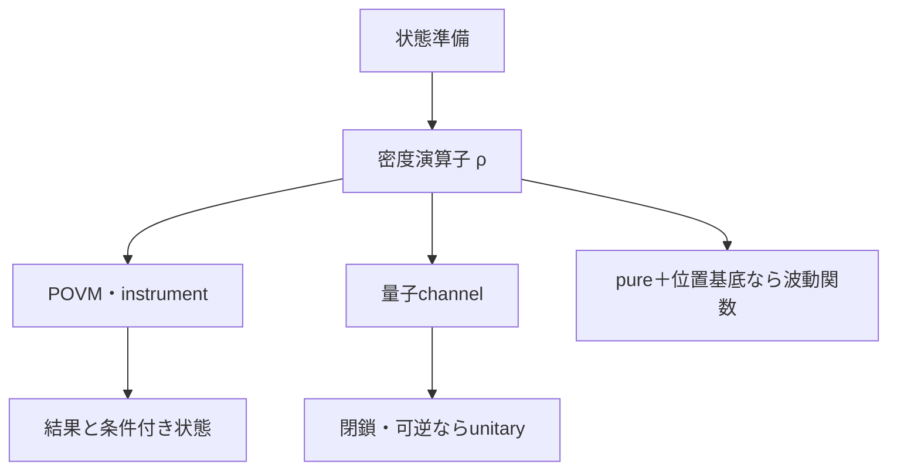

# part02 現代量子論の一般構造

歴史的実験を後世の形式で読み直した後、波動関数より一般的な「準備・状態・測定・変化」の枠組みを二準位系から組み立てます。

## 読む順序

1. [状態準備・測定設定・結果](01_preparation_state_measurement.md)
2. [古典確率から密度演算子へ](02_classical_probability_density_operator.md)
3. [pure state・mixed state・状態vector](03_pure_mixed_state_vector.md)
4. [一般化Born則とPOVM](04_generalized_born_povm.md)
5. [PVM・物理量・自己共役演算子](05_pvm_observables.md)
6. [測定後状態とquantum instrument](06_instruments_state_update.md)
7. [量子channelとunitary発展](07_channels_unitary.md)
8. [合成系・partial trace・entanglement](08_composite_entanglement.md)
9. [decoherenceと状態tomography](09_decoherence_tomography.md)
10. [一般形式から波動関数・Schrödinger方程式へ](10_to_wavefunction_schrodinger.md)

## 再構成についての注意

古典確率の行列表現、確率混合の線形性、状態から結果確率へのaffine map、可逆性、合成系を手掛かりに標準量子論の構造を説明します。これは構造を理解するための再構成であり、少数の経験的前提だけから現在の公理系が唯一必然的に導かれることを示すものではありません。無限次元、連続量、超選択則、量子場では追加の数学と物理的入力が要ります。

## ナビゲーション

- 前：[歴史的実験](../part01_mysteries/README.md)
- 次：[標準形式への橋](../part11_standard_formalism/README.md)
- 数学補習：[量子数学診断](../remedial_room/README.md)

