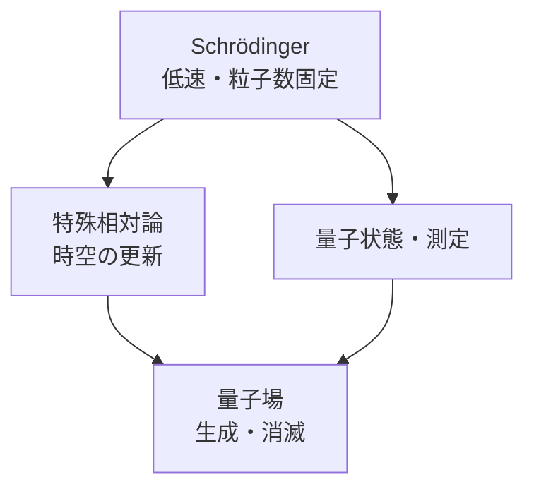

# Schrödinger方程式から相対論的量子論・場へ

## 非相対論的であること

Schrödingerの自由粒子は

$$
E=\frac{p^2}{2m}
$$

を使います。特殊相対論では

$$
E^2=p^2c^2+m^2c^4
$$

です。この両立を目指すとKlein–Gordon方程式やDirac方程式へ進みます。

## 二つの入口

Klein–Gordon方程式は概略

$$
\left(
\frac1{c^2}\frac{\partial^2}{\partial t^2}
-\nabla^2+\frac{m^2c^2}{\hbar^2}
\right)\phi=0
$$

です。一粒子確率密度を

$$
|\phi|^2
$$

とするSchrödinger型解釈には問題があり、場として量子化すると自然になります。

Dirac方程式

$$
i\hbar\frac{\partial\psi}{\partial t}
=\left(c\boldsymbol\alpha\cdot\hat{\mathbf p}+\beta mc^2\right)\psi
$$

は時間・空間に一階で、spin

$$
\frac12
$$

とantiparticleを理論構造から結びます。ただし「負energy海」を一粒子だけで完結させるより、field operatorの励起として粒子・反粒子を扱います。

## 一粒子量子力学の境界

高energyでは

$$
E\gtrsim2mc^2
$$

のscaleで粒子・反粒子対の生成が可能になり、粒子数固定のwave functionでは閉じません。photonの吸収・放出、真空、相対論的因果律も場の量子論が必要です。

特殊相対論の導出は[06_relativity](../../06_relativity/00_overview.md)、field quantizationは[08_elementary_particle](../../08_elementary_particle/00_overview.md)へ保留します。

## 演習と全解答

1.
   $$
   p\ll mc
   $$
   で相対論energyを展開せよ。
   **解答**：
   $$
   E=mc^2\sqrt{1+p^2/(m^2c^2)}
   \simeq mc^2+\frac{p^2}{2m}
   $$
2. rest energyを非相対論力学で通常無視できる理由を述べよ。
   **解答**：固定粒子数なら共通定数で、相対phase以外の運動方程式へ影響しないためです。
3. Klein–Gordon式が時間二階であることの一粒子解釈上の難しさを述べよ。
   **解答**：保存densityが正定値確率にならず、初期条件も
   $$
   \phi,\partial_t\phi
   $$
   を要します。
4. Dirac理論がspinを古典自転として仮定するか。
   **解答**：しません。Lorentz対称なspinor表現から現れます。
5. 粒子数が変わる現象を二つ挙げよ。
   **解答**：photon emission・absorption、electron–positron対生成・消滅です。
6. 本記事だけでDirac方程式を「導出済み」としてよいか。
   **解答**：不可です。Lorentz変換、spinor、gamma行列は相対論後に扱います。

## ナビゲーション

- 前：[量子情報](../part07_quantum_computing/README.md)
- 次：[相対論](../../06_relativity/00_overview.md)
- 将来：[場・素粒子](../../08_elementary_particle/00_overview.md)
