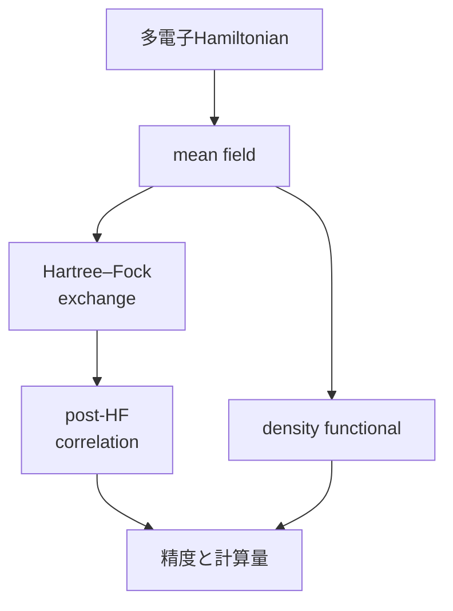

# 多電子原子と量子化学――何を近似するか

## 難しさの源

多電子Hamiltonianは概略

$$
\hat H=\sum_i\left(
-\frac{\hbar^2}{2m_e}\nabla_i^2
-\sum_A\frac{Z_Ae^2}{4\pi\varepsilon_0r_{iA}}
\right)
+\sum_{i<j}\frac{e^2}{4\pi\varepsilon_0r_{ij}}
$$

です。最後のelectron間反発が座標を結合し、水素型の一電子方程式へ分離できません。

## 近似の階層

Hartree–Fockは一つのSlater determinantでantisymmetryとexchangeを入れますが、同spin・異spinの動的correlationを完全には含みません。post-HFはconfiguration interactionやcoupled clusterへ、density functional theoryは密度を基本変数とする別の近似routeへ進みます。

「ab initio」は無近似という意味ではありません。basis set、固定核、相対論効果、電子相関、数値収束を選びます。

## 演習と全解答

1. electron間反発項が一電子方程式の単純和でない理由を述べよ。
   **解答**：
   $$
   r_{ij}
   $$
   が二electron座標へ同時に依存するためです。
2. Hartree productとSlater determinantの違いを述べよ。
   **解答**：後者は粒子交換で符号反転し、fermion antisymmetryを満たします。
3. exchangeとCoulomb反発は同じものか。
   **解答**：exchangeはantisymmetryから生じる量子効果で、古典的反発項そのものとは区別します。
4. basisを増やせば必ず厳密解へ単調に近づくか。
   **解答**：変分法の同一model内ではenergy上限が改善しますが、固定核・相対論無視・近似functionalなど別の誤差は残ります。
5. 量子化学で計算対象を二つ挙げよ。
   **解答**：分子energy・構造、反応障壁、spectra、電荷分布などです。
6. 場の量子論が必要になる境界を述べよ。
   **解答**：高energy相対論効果、粒子生成消滅、量子電磁場との精密相互作用です。

## ナビゲーション

- 前：[分子軌道](02_molecular_orbitals_and_bonds.md)
- 次：[固体とband](../part10_solid_state_semiconductors/01_periodic_potentials_bloch_bands.md)
- 多体系：[mean field](../part05_many_body/02_exchange_slater_mean_field.md)
