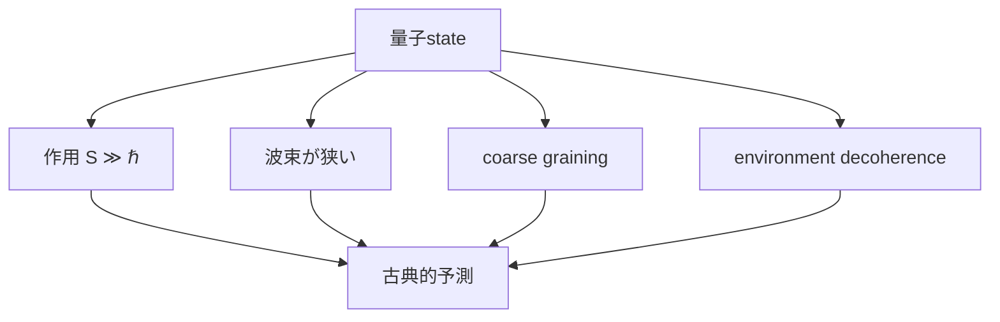

# Ehrenfest・WKB・古典極限――どう以前の理論へ戻るか

## 現代量子論から見ると

pure-state wave mechanicsのsemiclassical approximationだけでなく、現実のclassicalityにはmixed state、coarse graining、environment-induced decoherenceも関わります。

## 期待値の運動

Schrödinger式から

$$
\frac{d}{dt}\langle\hat x\rangle=\frac{\langle\hat p\rangle}{m}
$$

$$
\frac{d}{dt}\langle\hat p\rangle=
-\left\langle\frac{dV}{dx}\right\rangle
$$

を得ます。これはEhrenfestの定理です。ただし一般に

$$
\left\langle V'(\hat x)\right\rangle
\neq V'(\langle\hat x\rangle)
$$

なので、期待値が常にNewton軌道へ厳密に従うわけではありません。potentialがpacket幅でほぼ線形、packetが狭い、という近似が要ります。

## WKBの入口

$$
\psi(x)=A(x)e^{iS(x)/\hbar}
$$

を定常Schrödinger式へ入れ、

$$
\hbar
$$

の最低次を見るとHamilton–Jacobi関係

$$
\frac{1}{2m}\left(\frac{dS}{dx}\right)^2+V=E
$$

が現れます。局所de Broglie波長に比べpotentialがゆっくり変化する領域で

$$
\psi(x)\approx\frac{C}{\sqrt{p(x)}}\exp\left(\pm\frac{i}{\hbar}\int^x p(x')dx'\right)
$$

です。turning pointではそのまま使えません。

## 古典極限は一つの操作ではない

単に

$$
\hbar=0
$$

と置くのではなく、対象scale・state・observable・環境を指定します。

## 演習と全解答

1. 自由粒子でEhrenfest式を解釈せよ。
   **解答**：
   $$
   d\langle p\rangle/dt=0
   $$
   で、平均位置は一定速度で動きます。
2. 調和振動子で期待値が厳密に古典式へ従うことを示せ。
   **解答**：
   $$
   V'=m\omega^2x
   $$
   は線形なので
   $$
   \langle V'\rangle=m\omega^2\langle x\rangle
   $$
   です。
3. WKB位相の次元を確認せよ。
   **解答**：
   $$
   \int p\,dx
   $$
   はaction
   $$
   \mathrm{J\,s}
   $$
   で、
   $$
   \hbar
   $$
   で割ると無次元です。
4. turning pointでWKBが破れる理由を述べよ。
   **解答**：
   $$
   p(x)\to0
   $$
   で振幅
   $$
   1/\sqrt p
   $$
   が発散し、ゆっくり変化する近似も失敗します。
5. 巨視的物体でも量子効果が原理的にzeroか。
   **解答**：zeroではありませんが、action scale、環境decoherence、分解能により干渉が観測困難になります。
6. 高い量子数だけで必ず古典化するか。
   **解答**：observableやstateによります。特殊な重ね合わせは非古典的干渉を保ち得るため、coarse grainingやdecoherenceも確認します。

## ナビゲーション

- 前：[調和振動子](04_harmonic_oscillator_four_views.md)
- 次：[解析力学からの接続](../part06_via_analytical_mech/README.md)
- 横断：[古典極限](../../cross_connections/07_model_changes_to_quantum_statistics.md)
