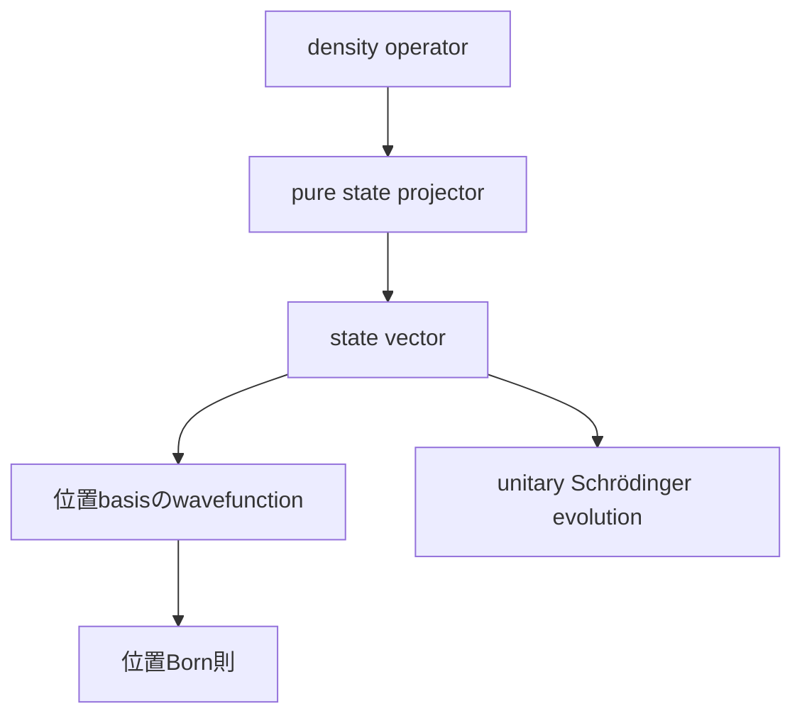

# part11 標準量子力学への橋――状態vector・波動関数・演算子

現代量子論の一般構造を学んだ後、pure stateとprojective measurementへ限定し、標準教科書で使うstate vector・wavefunction・operatorへ接続します。

> 一般状態はdensity operator、一般測定はPOVM、測定後状態はinstrument、一般の状態変化はCPTP channelです。このpartでは主にpure state、ideal PVM、閉鎖系unitaryという重要な特殊化を扱います。

1. [状態・波動関数・Born則](01_state_wavefunction_born.md)
2. [重ね合わせ・相対位相・量子確率](02_superposition_phase_quantum_probability.md)
3. [Hilbert空間・演算子・固有値](03_hilbert_operators_eigenvalues.md)
4. [可換性・不確定性・Fourier表示](04_commutators_uncertainty_fourier.md)
5. [量子力学の解釈](05_measurement_decoherence_interpretations.md)

位置波動関数はpure stateの一つの表示です。一般形式と特殊化、計算規則と解釈を区別します。

- 前：[現代量子論の一般構造](../part02_modern_formalism/README.md)
- 次：[Schrödinger dynamics](../part09_schrodinger_dynamics/README.md)
- 親：[章overview](../00_overview.md)
