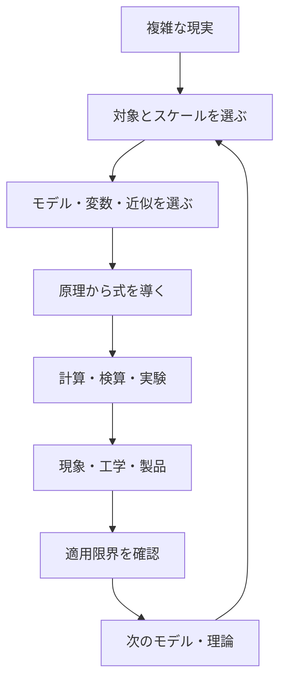
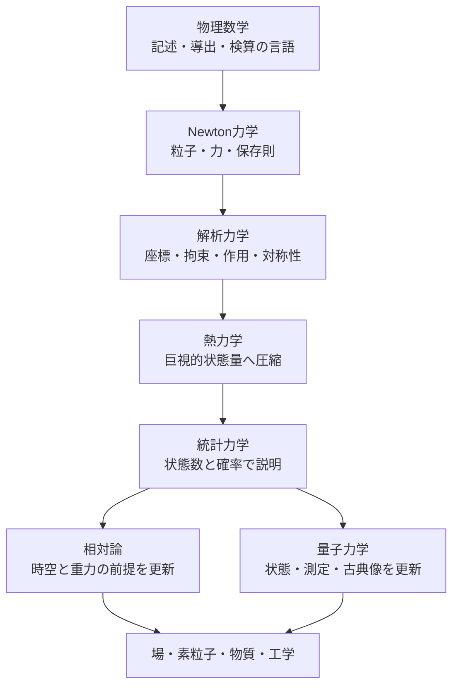

# 物理学タワー（Physics Tower）

Physics Tower は、分野別の公式を網羅するだけの教科書ではありません。複雑な現実から目的に合う対象・変数・スケールを選び、モデルと近似を置き、少数の原理から式を導き、現象・工学・製品へ適用し、限界から次の理論へ進むための教科書です。

## 1. タワーを貫く問い

現実を丸ごと計算することはできません。物理で問うのは「何を残せば目的に十分か」です。

この循環では、予測が外れたときに式だけを直すのではなく、系の境界、自由度、時間・長さスケール、無視した相互作用まで戻って点検します。

## 2. 普通の教科書との違い

- 公式より先に「なぜこの概念が必要か」を置く。
- 導出と同時に、対象・省略・成立条件を明記する。
- 同じ現象を別の理論でどう再記述するか比較する。
- 数値、次元、符号、極限、保存則で検算する。
- 現象から回路・半導体・計算基盤などの技術へ接続する。
- 理論の失敗を欠点として隠さず、次章への入口として扱う。

## 3. 4つの軸

| 軸 | 問うこと | 代表例 |
|---|---|---|
| モデル | 何を基本要素・変数とするか | 点粒子、剛体、連続体、場、状態量、確率分布 |
| 近似 | 何を無視し、どのスケールに限るか | 摩擦なし、準静的、希薄気体、熱力学極限 |
| 保存則 | 系の中で何の収支が閉じるか | 運動量、角運動量、エネルギー、電荷 |
| 対称性 | どの変換で記述が変わらないか | 並進、回転、時間並進、ゲージ |

保存則は Newton 力学では力の総和から、解析力学では対称性から、熱力学では収支式として、統計力学では巨視的平均として現れます。

## 4. 章間のモデル交代

### 物理数学

[物理数学ツール](00_physics_math_tools/00_overview.md)は独立した公式集ではなく、物理に現れる構造を記述し、解き、検算する道具です。

### Newton力学

[力学](01_dynamics/00_overview.md)は系と時間区間を選び、運動量・エネルギー・角運動量を使い分ける保存則中心の教材です。しかし、拘束力の成分計算が煩雑、自由度に合う座標を使いたい、対称性と保存量を直接見たい、多自由度・場・量子へ一般化したい、という地点で解析力学が必要になります。

### 解析力学

[解析力学](03_analytical_mechanics/00_overview.md)は Newton 力学とは別の自然法則ではありません。適切な条件で同じ運動を、一般化座標、Lagrangian、作用、Hamiltonian、位相空間で再記述します。

### 熱力学と統計力学

[熱力学](04_thermodynamics/00_overview.md)は個々の粒子を追わず、温度・圧力・体積・内部エネルギー・エントロピーなどの巨視量だけで可能な過程、平衡、最大効率を予測します。[統計力学](05_statistical_mechanics/00_overview.md)は微視的モデルと確率を導入し、その法則の理由と物質固有の値を説明します。熱力学は統計力学の不完全版ではなく、微視構造に依存しない独立した有効理論です。

### 電磁気学：設計思想の完成例

[電磁気学](02_electromagnetism/00_overview.md)では、次の縮約と再拡張を実装済みです。

> 電荷・場 → Maxwell 方程式 → 波動・物質応答 → 電圧・電流・RLC → 回路・工学 → 半導体 → memory・GPU・AI計算基盤 → 量子・統計力学で微視的理由を再訪

場から回路へ空間分布を端子量に縮約し、集中定数近似の限界では伝送線路や場へ戻ります。半導体では古典電磁気学で電位・電荷・電流を扱い、バンド構造は量子力学、Fermi 準位とキャリア密度は統計力学へ保留しました。これは「どこまで説明し、どこで次のモデルへ渡すか」の代表例です。

## 5. 本線・支線・補習・Q&A

- **本線**：番号順の章と各 `part`。前提から中心導出を積み上げる。
- **支線**：現代応用や会話由来の問い。正本を複製せず本線へ戻す。
- **補習**：微積分、確率、数え上げなど、止まった操作だけを回収する。
- **Q&A**：似た概念の混同、モデルや解法の選択を診断する。
- **横断記事**：[cross_connections](cross_connections/README.md) で複数章の同名概念とモデル交代を比較する。

## 6. 読者別ルート

- 初学者：物理数学 → 力学 → 解析力学 → 熱力学 → 統計力学。
- 工学：力学 → 解析力学の拘束・ロボット → 電磁気学の回路・半導体 → 熱・統計。
- 半導体・AI hardware：電磁気学 part06/07 → 統計力学の量子統計・carrier → 量子力学。
- 理論物理：解析力学の作用・Noether・Hamilton → 相対論／量子／場。
- データ・機械学習：確率補習 → 統計力学の entropy・maximum entropy・Monte Carlo・energy-based model。
- 現象から入りたい読者：熱機関、相転移、半導体などの応用記事から、必要な原理へ逆向きに戻る。

## 7. 現在の完成状態

| 章 | 状態 |
|---|---|
| 00 物理数学ツール | 本文化済み |
| 01 力学 | 本文化済み |
| 02 電磁気学 | 場 → 回路 → 半導体 → memory・GPU → AI計算基盤まで本文化済み |
| 03 解析力学 | 本線・比較例・接続を本文化済み |
| 04 熱力学 | 法則・entropy・potential・工学応用を本文化済み |
| 05 統計力学 | 状態数・ensemble・量子統計・半導体・応用を本文化済み |
| 06 相対論以降 | `PROGRESS.md` の TODO |

実際のレビュー状態は [PROGRESS.md](PROGRESS.md) を正本とします。

## 8. 今後の執筆方針

新規記事は、必要性、対象、省略・近似、原理、前後の理論、計算可能な量、成立条件、破綻、応用、次に学ぶ内容を題材に応じて明示します。既存完成記事は一律改稿せず、新理論への導線や明確な不整合だけを最小修正します。

## 9. 記事品質の共通基準

主要記事は、問い・前提・到達目標、前理論との関係、対象と省略、直観、定義、中心導出、比較・数値例、検算、適用範囲、誤解、他分野接続、限界、固有演習と全解答、学習チェック、参考資料、相対ナビゲーションを題材に合う順序で備えます。同じ定型文を機械的に複製しません。

数式はブロック TeX を基本とし、図は関係や流れに Mermaid を使います。現代研究・製品の可変情報は一次資料、確認日、前提を残し、確立した理論・実証結果・解釈・推測を区別します。

## ナビゲーション

- 親：[プロジェクトREADME](../README.md)
- 進捗：[PROGRESS.md](PROGRESS.md)
- 次：[解析力学](03_analytical_mechanics/00_overview.md)
