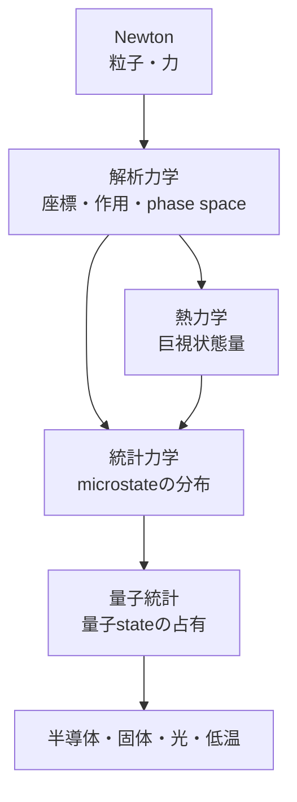

# 横断7：古典力学から量子統計までのモデル交代

## 何を残し、何を更新したか

| 段階 | 残す | 捨てる／更新する | 新しい予測 |
|---|---|---|---|
| Newton | trajectory、force | 複雑な拘束の成分表示 | 軌道 |
| analytical | 同じ古典軌道 | 冗長座標 | symmetry、canonical構造 |
| thermo | energy・boundary | 個別trajectory | 効率、平衡、不可能過程 |
| statistical | Hamiltonian・state count | 実microstateの特定 | 平均、揺らぎ、物質差 |
| quantum statistics | 量子state | distinguishable classical particle | electron・photon占有 |

## 境界判定

$$
n\lambda_{\mathrm{th}}^3\ll1
$$

ならclassical statisticsへ戻ります。低温・高密度・同種粒子ではFermi/Boseが必要です。さらに許されるstateと時間発展自体はquantum mechanicsが担当します。

## semiconductorで一周する

Maxwell/Poissonがfieldとcharge distributionを制約し、quantum mechanicsがbandとstate densityを与え、quantum statisticsがoccupancyとcarrier densityを与え、transport theoryがcurrentを与え、thermodynamicsがheat budgetを制約します。一理論で全部を説明しません。

## 演習と解答

1. 熱力学でparticle trajectoryを残すか。
   **解答**：残しません。
2. 統計力学ではHamiltonianを捨てるか。
   **解答**：残し、stateのweightを決めます。
3. quantum mechanicsとquantum statisticsの違いは何か。
   **解答**：前者はstateと時間発展、後者は多数のquantum stateの占有です。
4. electron densityだけでbandを導けるか。
   **解答**：できません。
5. high-temperature dilute gasはどこへ戻るか。
   **解答**：Maxwell–Boltzmann classical statisticsです。
6. modelが破綻したとき最初に確認するものは何か。
   **解答**：対象、scale、自由度、近似、境界、未導入相互作用です。

## 次

量子状態そのものへ進む読者は[量子力学](../07_quantum_mechanics/00_overview.md)、時空の前提を更新する読者は[相対論](../06_relativity/00_overview.md)へ進みます。

- 前：[対称性と相](06_symmetry_conservation_equilibrium_phase.md)
- 親：[横断記事](README.md)
